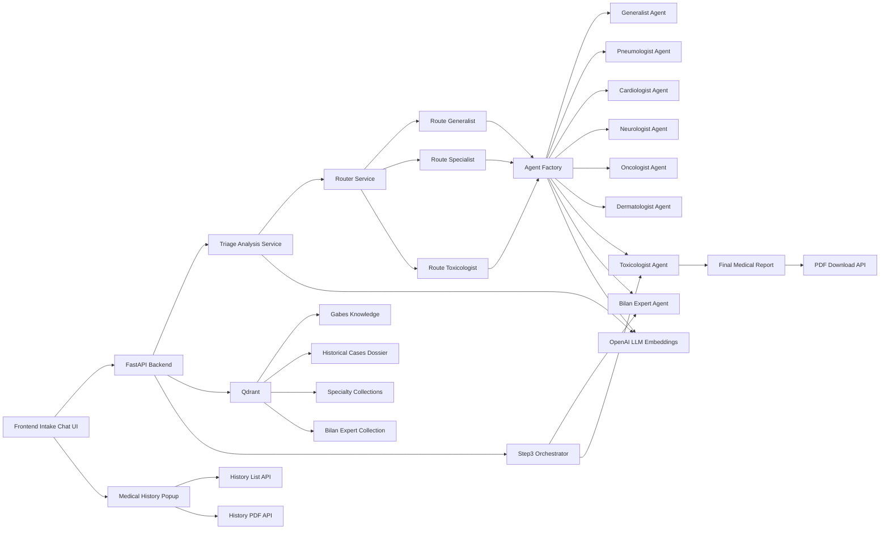
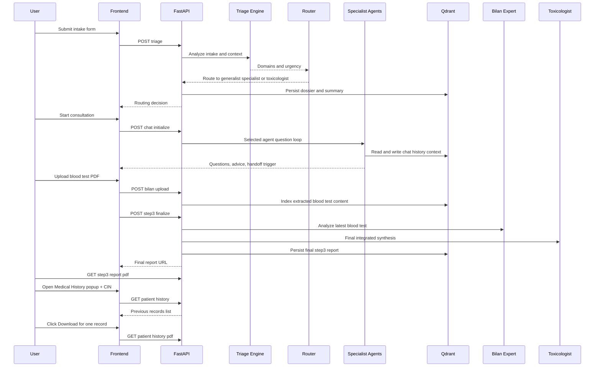

# Gabes Medical Triage - Multi-Agent RAG Platform

[](https://www.python.org/)
[](https://fastapi.tiangolo.com/)
[](https://www.uvicorn.org/)
[](https://platform.openai.com/)
[](https://qdrant.tech/)
[](https://www.langchain.com/langsmith)
[](https://www.reportlab.com/)
[](#license)

Production-focused clinical triage and consultation system for Gabes.  
It combines structured intake, specialty routing, multi-agent dialogue, blood-test analysis, and final medical reporting (including downloadable PDF) using an agentic RAG architecture.

## Table of Contents
- [Why This Project](#why-this-project)
- [Core Capabilities](#core-capabilities)
- [System Architecture](#system-architecture)
- [Pipeline](#pipeline)
- [Agent Catalog](#agent-catalog)
- [Technical Stack](#technical-stack)
- [Repository Structure](#repository-structure)
- [API Reference](#api-reference)
- [Data and Collections](#data-and-collections)
- [Environment Variables](#environment-variables)
- [Local Execution](#local-execution)
- [Production Execution Plan](#production-execution-plan)
- [Example End-to-End Use Case](#example-end-to-end-use-case)
- [Quality, Observability, and Safety](#quality-observability-and-safety)
- [Roadmap](#roadmap)
- [Major Design Notes](#major-design-notes)
- [Medical Disclaimer](#medical-disclaimer)
- [License](#license)

## Why This Project
Gabes has specific industrial exposure risk profiles. This platform is built to:
- Triage patients quickly from structured intake.
- Route to the right specialist with confidence gating.
- Preserve a longitudinal patient dossier by CIN.
- Support specialist-grade questioning and handoffs.
- Integrate blood-test evidence when needed.
- Produce a complete medical report for human clinicians.

## Core Capabilities
- Structured intake (20+ clinical/environmental signals).
- LLM triage (`gpt-4o-mini`) with domain ranking and urgency estimation.
- Router confidence gate (default to Generalist when unclear).
- Explicit routing paths to `generalist` and `toxicologist` when clinically indicated.
- Multi-agent specialist consultation with controlled handoff.
- Qdrant-backed RAG for specialty and historical context.
- Blood-test PDF upload, extraction, indexing, and expert interpretation.
- Toxicology final synthesis with urgency decision.
- Downloadable final PDF report (structured physician format).
- Medical History popup by CIN with previous records list + per-record PDF download.

## System Architecture


## Pipeline


## Agent Catalog
All agents inherit from `BaseAgent` and operate over patient CIN-linked dossier and Qdrant context.

1. `GeneralistAgent`
- Role: first-line clarification when routing confidence is low or symptoms are vague.
- Behavior: asks one focused question per turn; can transfer using `[SUGGEST_TRANSFER: ...]`.
- Collection: `generaliste_collection`.

2. `PneumologueAgent` (Pneumologist)
- Role: respiratory triage, pulmonary irritation/exposure reasoning.
- Behavior: mandatory clarification before toxicology transfer unless life-threatening.
- Collection: `pneumologue_collection`.

3. `CardiologueAgent` (Cardiologist)
- Role: chest pain, palpitations, hemodynamic concern.
- Behavior: mandatory clarification before toxicology transfer unless red flag.
- Collection: `cardiologue_collection`.

4. `NeurologueAgent` (Neurologist)
- Role: neurological symptoms, cognitive/neuromotor concern.
- Behavior: mandatory clarification before toxicology transfer unless red flag.
- Collection: `neurologue_collection`.

5. `OncologueAgent` (Oncologist)
- Role: oncologic suspicion and workup-oriented questioning.
- Behavior: mandatory clarification before toxicology transfer unless red flag.
- Collection: `oncologue_collection`.

6. `DermatologueAgent` (Dermatologist)
- Role: chemical/industrial dermatologic manifestations.
- Behavior: mandatory clarification before toxicology transfer unless red flag.
- Collection: `dermatologue_collection`.

7. `ToxicologueAgent` (Toxicologist)
- Role: exposure-specific synthesis, treatment pathway, urgency decision.
- Behavior: can request blood tests with `[REQUEST_BILAN_SANGUIN]`; produces final integrated synthesis.
- Collection: `toxicologue_collection`.

8. `BilanExpertAgent`
- Role: blood-test interpretation (markers, toxicology signals, confidence).
- Behavior: analyzes latest uploaded blood-test text and hands off to toxicologist finalization.
- Collection: `bilan_expert_collection`.

## Technical Stack
- Backend: FastAPI, Uvicorn, Pydantic.
- Frontend: Static HTML/CSS/JS chat + intake experience.
- LLM: OpenAI `gpt-4o-mini`.
- Embeddings: OpenAI `text-embedding-3-large` (3072 dims).
- Vector DB: Qdrant Cloud.
- Sparse retrieval fallback: FastEmbed SPLADE (`prithivida/Splade_PP_en_v1`) when available.
- Observability: LangSmith tracing.
- Document parsing: `pypdf`.
- Reporting: ReportLab (structured PDF generation).
- Optional persistence: Supabase metadata sink.

## Repository Structure
```text
med/
|- agents/
|  |- base.py
|  |- generalist_agent.py
|  |- pneumologue_agent.py
|  |- cardiologue_agent.py
|  |- neurologue_agent.py
|  |- oncologue_agent.py
|  |- dermatologue_agent.py
|  |- toxicologue_agent.py
|  |- bilan_expert_agent.py
|- models/
|- services/
|  |- triage_service.py
|  |- router_service.py
|  |- rag_service.py
|  |- persistence_service.py
|- static/
|  |- index.html
|  |- script.js
|  |- style.css
|- main.py
|- requirements.txt
```

## API Reference
1. `POST /triage`
- Purpose: run intake analysis + router decision.
- Input: `PatientIntake`.
- Output: `RouterDecision` with selected specialty and urgency.

2. `POST /api/chat`
- Purpose: multi-agent consultation turn.
- Input: `{ cin, message, agent }`.
- Output: agent response + transfer/lab request metadata.

3. `POST /api/bilan/upload`
- Purpose: upload and index blood-test PDF.
- Input: multipart (`cin`, `file`).
- Output: upload/index status + next agent hint.

4. `POST /api/step3/finalize`
- Purpose: orchestrate Bilan Expert + Toxicologist finalization.
- Input: `{ cin }`.
- Output: `bilan_analysis`, `toxicology_final`, `report_pdf_url`.

5. `GET /api/step3/report/pdf?cin=...`
- Purpose: download final structured clinical report as PDF.

6. `GET /health`
- Purpose: liveness probe.

7. `GET /api/patient/history?cin=...`
- Purpose: retrieve all previous dossier records for a CIN (for Medical History popup).

8. `GET /api/patient/history/report/pdf?cin=...&case_id=...`
- Purpose: download PDF report for a specific historical case record.

## Data and Collections
- `historical_cases`: dossier storage, chat history, indexed case payloads, blood-test documents.
- `gabes_knowledge`: core medical/environmental retrieval corpus.
- Specialty collections:
  - `generaliste_collection`
  - `pneumologue_collection`
  - `cardiologue_collection`
  - `neurologue_collection`
  - `oncologue_collection`
  - `dermatologue_collection`
  - `toxicologue_collection`
- `bilan_expert_collection`: blood-analysis reference corpus.

## Environment Variables
Required:
- `OPENAI_API_KEY`
- `QDRANT_URL`
- `QDRANT_API_KEY`

Recommended:
- `BILAN_EXPERT_COLLECTION=bilan_expert_collection`
- `LANGSMITH_API_KEY`
- `LANGCHAIN_TRACING_V2=true`
- `LANGCHAIN_PROJECT=gabes-med-triage`

Optional:
- `SUPABASE_URL`
- `SUPABASE_KEY`

## Local Execution
1. Create and activate virtual environment:
```powershell
python -m venv .venv
.venv\Scripts\Activate.ps1
```

2. Install dependencies:
```powershell
pip install -r requirements.txt
```

3. Start backend:
```powershell
python -m uvicorn main:app --host 127.0.0.1 --port 8000 --reload
```

4. Open frontend:
- `http://127.0.0.1:8000/`

## Production Execution Plan
1. Infrastructure
- Provision managed Qdrant cluster with backups and TLS.
- Use secret manager for API keys and rotate regularly.
- Deploy FastAPI behind reverse proxy (Nginx/Traefik) with HTTPS.

2. Reliability
- Add startup checks for required collections.
- Add retry/backoff policies for OpenAI and Qdrant calls.
- Add background worker for heavy PDF/doc post-processing if load increases.

3. Security
- Add authentication and role-based access (patient/clinician/admin).
- Encrypt PHI at rest and in transit.
- Add request rate-limits and abuse protection.

4. Compliance and Governance
- Implement explicit consent logging for patient data.
- Add immutable audit trail for report generation and handoffs.
- Define retention and deletion policies by jurisdiction.

5. Observability
- Standardize structured logs with correlation IDs.
- Track latency SLOs per endpoint (`/triage`, `/api/chat`, `/api/step3/finalize`).
- Build dashboards for transfer rates, urgency mix, and failure rates.

6. Testing and Release
- Add unit tests for router logic and agent guardrails.
- Add integration tests for full Step 1-2-3 flow.
- Add canary deployment and rollback plan.

## Example End-to-End Use Case
Scenario: Patient reports wheezing + cough after industrial exposure.

1. Intake submitted with exposure details.
2. `/triage` routes to Pneumologist with moderate/high concern.
3. Pneumologist asks clarifying questions.
4. If toxicity suspicion rises, handoff to Toxicologist.
5. Toxicologist requests blood test (`[REQUEST_BILAN_SANGUIN]`) if needed.
6. User uploads PDF via `/api/bilan/upload`.
7. `/api/step3/finalize` runs:
- Bilan Expert extracts abnormalities.
- Toxicologist produces integrated conclusion and urgency.
8. Final PDF report generated and downloaded for physical clinician follow-up.

## Quality, Observability, and Safety
- Router confidence threshold defaults ambiguous cases to Generalist.
- Agent guardrails reduce premature final reports and repeated questioning.
- Tracing instrumentation enabled through LangSmith decorators.
- Final report includes urgency statement and actionability for clinician handoff.

## Roadmap
- Add clinician dashboard and case timeline view.
- Add multi-file upload support (imaging + labs + prescriptions).
- Add deterministic treatment protocol templates by specialty.
- Add multilingual report export (English/French/Arabic).
- Add standardized ICD/SNOMED coding enrichment.
- Add load testing and autoscaling profiles.
- Add policy engine for stricter emergency escalation.

## Major Design Notes
- The system is designed as a clinical decision-support workflow, not autonomous care.
- Toxicology is treated as a specialized escalation path, not a universal fallback.
- Blood-test analysis is explicit and staged (upload -> interpretation -> synthesis -> report).
- CIN acts as the longitudinal key across triage, chat, and reporting.

## Medical Disclaimer
This platform is a clinical triage aid and decision-support tool.  
It does not replace licensed physician judgment, diagnosis, or emergency services.

If a patient presents severe respiratory distress, active bleeding, altered consciousness, or chest pain, escalate immediately to emergency care.

## License
Private project. Define and add a formal license before public distribution.
