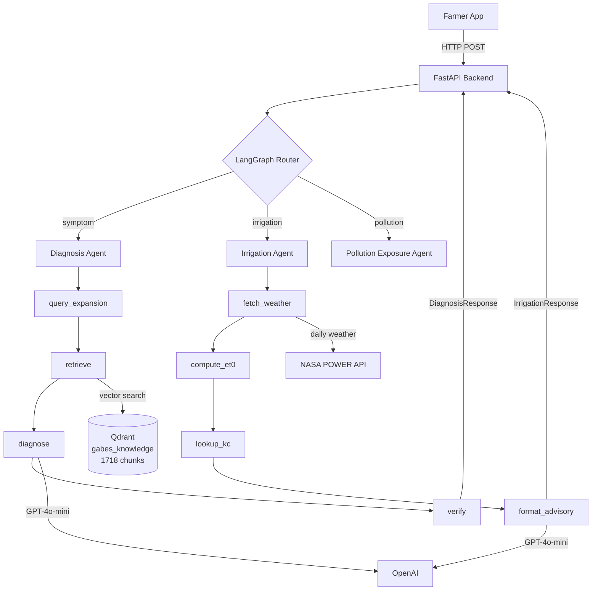
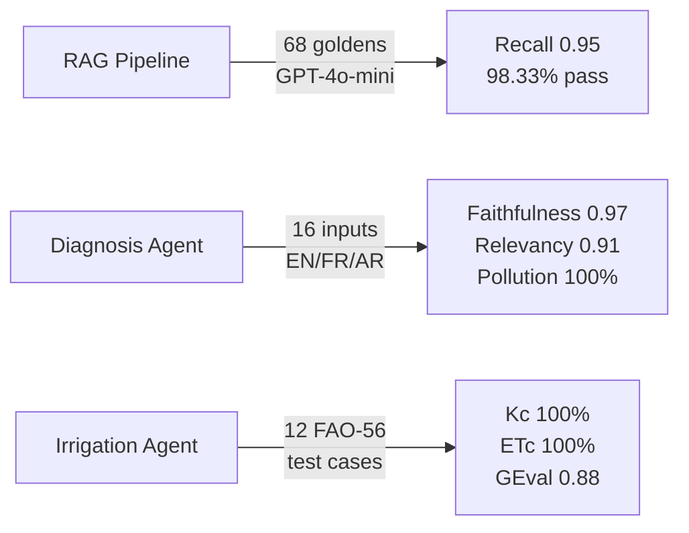

<div align="center">

# 🌿 Gabesi AIGuardian

**An agentic AI system that gives Gabès oasis farmers real-time environmental
intelligence — crop diagnostics, irrigation guidance, and pollution exposure
tracking — powered by RAG, LangGraph agents, and a grounded scientific
knowledge base.**

[](https://python.org)
[](https://github.com/langchain-ai/langgraph)
[](https://fastapi.tiangolo.com)
[](https://qdrant.tech)
[](https://deepeval.com)
[](LICENSE)

</div>

---

## 🎬 Demo Preview

🚧 Demo screenshots coming soon
A full demo video and interactive dashboard will be available soon.

---

## 🌍 The Problem

Gabès, Tunisia is home to the **only coastal oasis in the Mediterranean** — and
it is being destroyed. The Tunisian Chemical Group (GCT) has discharged large quantities of phosphogypsum into the Gulf since 1972. SO₂, fluoride,
and heavy metals blanket the oasis zones. Soil salinity rises every year.

The environmental cost: **76 million Tunisian dinars per year**.
The farmers who bear this cost have **zero access to the data that documents it**.

---

## 💡 What Gabesi AIGuardian Does

A farmer opens the app and asks: *"Why are my palm trees yellowing?"*

The system:
1. Expands the symptom into domain-specific search queries
2. Retrieves evidence from scientific papers, municipal audits, and EU project
   reports grounded in the Gabès oasis context
3. Diagnoses the probable cause — pollution, pest, disease, or irrigation —
   with a faithfulness-verified response
4. Returns a plain-language diagnosis in the farmer's language (Arabic, French,
   or English) with a concrete action and cited sources

Additionally, the system includes a **Pollution Exposure Agent** that:

- Analyzes historical and forecast air quality data
- Identifies dominant pollutants (SO₂, NO₂)
- Detects exposure trends
- Generates per-plot risk assessments
- Provides actionable recommendations tailored to farm location
- Uses deterministic and explainable modeling (no black-box predictions)

---

## 🧠 How It Works (Simple)

User → FastAPI → LangGraph Router → Specialized Agent → Structured Response

- The router selects the correct agent (diagnosis, irrigation, pollution)
- Each agent executes a deterministic + AI-assisted pipeline
- The system returns a grounded, explainable result in the user’s language

---

## ⚡ Key Features

- 🌱 **Symptom Diagnosis Agent**
  - RAG-powered, faithfulness-verified crop diagnosis

- 💧 **Irrigation Advisory Agent**
  - FAO-56 compliant ET₀ and crop coefficient modeling

- 🌫️ **Pollution Exposure Agent**
  - Deterministic, explainable pollution risk modeling (SO₂, NO₂)
  - Per-plot exposure classification (near_gct → ultra_remote)
  - Actionable recommendations with calibrated confidence

- 🌍 **Multilingual Support**
  - Arabic, French, and English outputs

- 🔍 **Grounded Scientific Knowledge**
  - 1,700+ curated chunks from domain-specific sources

---

## 🌫️ Pollution Intelligence (Key Innovation)

A core innovation of this system is the **Pollution Exposure Agent**, which transforms regional atmospheric data into actionable, farm-level insights.

- Deterministic and explainable modeling (no black-box predictions)
- Per-plot exposure classification (near_gct → ultra_remote)
- Historical + forecast risk analysis
- Dominant pollutant detection (SO₂, NO₂)
- Actionable recommendations with calibrated confidence
- Designed for real-world decision support, not generic reporting

---

## 🧠 Why This Is Different

Unlike generic AI assistants or black-box models, Gabesi AIGuardian:

- Uses **deterministic + explainable modeling** for pollution analysis
- Verifies diagnosis responses with **faithfulness checks**
- Avoids hallucinations through **grounded RAG pipelines**
- Explicitly communicates **confidence and limitations**
- Is tailored specifically to the **Gabès environmental context**

---

## 🏗️ Architecture



---

## 📂 Project Structure

```
Gabesi-AIGuardian/
├── backend/
│   ├── app/
│   │   ├── main.py                # FastAPI app (lifespan, CORS, router)
│   │   ├── config.py              # Pydantic settings (loaded from .env)
│   │   ├── agents/
│   │   │   ├── diagnosis_agent.py # LangGraph: query_expansion→retrieve→diagnose→verify
│   │   │   ├── irrigation_agent.py # FAO-56 compliance + advisory generation
│   │   │   └── pollution_agent.py  # Deterministic exposure modeling + insights
│   │   ├── api/
│   │   │   └── routes.py          # POST /diagnosis, GET /health
│   │   ├── models/
│   │   │   └── diagnosis.py       # DiagnosisRequest, DiagnosisResponse, RetrievedChunk
│   │   └── rag/
│   │       └── retriever.py       # QdrantRetriever (text-embedding-3-large)
│   ├── tests/
│   │   └── test_diagnosis_agent.py # 4 pytest tests (zero real API calls)
│   └── requirements.txt           # All dependencies (merged root + backend)
├── data/                          # Knowledge corpus (gitignored)
│   ├── papers/                    # Scientific PDFs
│   ├── pdl_reports/               # Municipal + EU project reports
│   ├── processed/                 # Preprocessed markdown (41 PDL tables)
│   ├── references/                # FAO-56 irrigation reference
│   └── structured/                # JSON: oasis zones, GCT coords, crop Kc values
├── eval_data/                     # Gitignored — generated by eval scripts
├── eval_results/                  # Gitignored — generated by eval scripts
├── scripts/
│   ├── preprocess_docx.py         # PDL docx → markdown, 41 tables preserved
│   ├── ingest.py                  # Chunk, embed, upsert to Qdrant
│   ├── smoke_test.py              # 6-query retrieval verification
│   ├── evaluate_retrieval.py      # DeepEval retrieval pipeline
│   ├── evaluate_diagnosis.py      # DeepEval diagnosis agent pipeline
│   └── evaluate_irrigation.py     # DeepEval irrigation agent pipeline
├── .env.example
└── README.md
```

---

## 🚀 Setup

### Prerequisites

- Python 3.12
- [Qdrant Cloud](https://cloud.qdrant.io) account (free tier works)
- OpenAI API key

### Installation

```bash
git clone https://github.com/omarfh111/Gabesi-AIGuardian.git
cd Gabesi-AIGuardian

python -m venv .venv
.venv\Scripts\activate      # Windows
# source .venv/bin/activate  # Mac/Linux

pip install -r backend/requirements.txt
```

### Environment

```bash
cp .env.example .env
# Fill in: QDRANT_URL, QDRANT_API_KEY, OPENAI_API_KEY
```

### Run the Backend

```bash
cd backend
uvicorn app.main:app --reload --port 8000
# API docs: http://localhost:8000/docs
```

### Reproduce the Knowledge Base

```bash
python scripts/preprocess_docx.py   # PDL docx → markdown
python scripts/ingest.py            # chunk + embed + upsert to Qdrant
python scripts/smoke_test.py        # verify retrieval
```

---

## 📊 Knowledge Base

| Collection | Documents | Chunks | Purpose |
|---|---|---|---|
| `gabes_knowledge` | 21 | 1,718 | Static domain RAG |
| `satellite_timeseries` | — | 0* | Weekly oasis snapshots |
| `farmer_context` | — | 0* | Per-farmer memory |

*Populated at runtime.

**Specs:** `text-embedding-3-large` · Chonkie SemanticChunker · dense + sparse
(BM25/IDF) vectors · payload indexes on `source_type`, `language`, `doc_name`

### Pollution Modeling Approach

The pollution agent does not rely on direct plot-level sensors. Instead, it combines:
- Open-Meteo CAMS atmospheric data (regional baseline)
- Deterministic exposure band modeling (distance-based attenuation)
- Relative threshold analysis (p80 / p95 background levels)

This ensures explainable, reproducible, and location-aware risk estimation without overclaiming precision.

---

## 📈 Evaluation

### Retrieval Pipeline

Evaluated with DeepEval · 68 synthetic goldens · GPT-4o-mini judge

| Metric | Score | Pass Rate | Status |
|---|---|---|---|
| Contextual Recall | **0.9512** | **98.33%** | ✅ Target met |
| Contextual Relevancy | 0.4395 | 41.67% | ⚠️ Known limitation* |

*Relevancy penalises multi-topic chunks (avg 841 chars). Recall is the
operationally meaningful metric for retrieval quality.

```bash
python scripts/evaluate_retrieval.py --synthesize-only --use-openai-synthesis --n-contexts 120
python scripts/evaluate_retrieval.py --eval-only --top-k 5
```

### Diagnosis Agent (Feature 2)

Evaluated with DeepEval · 16 synthetic farmer inputs · GPT-4o-mini judge
Inputs cover: pollution-linked, irrigation, pest/disease, mixed, vague symptoms
in English, French, and Arabic.

| Metric | Score | Pass Rate | Status |
|---|---|---|---|
| Faithfulness | **0.9667** | **100%** | ✅ Target met |
| Answer Relevancy | **0.9115** | **100%** | ✅ Target met |
| Pollution Link Accuracy | **100%** | **16/16** | ✅ Target met |

**Key design decisions evaluated:**
- Query expansion with conditional pollution queries — pollution queries only
  generated when symptom contains proximity signals (factory smell, white
  crust, multiple plots affected). Eliminates false pollution attribution for
  pure pest/irrigation cases.
- Faithfulness verification node — rejects diagnoses where < 50% of claims
  are grounded in retrieved chunks.

```bash
# Agent must be running
cd backend && uvicorn app.main:app --reload --port 8000

python scripts/evaluate_diagnosis.py --eval-only
```

### Irrigation Agent (Feature 3)

Evaluated with hardcoded FAO-56 test cases (12) · GPT-4o-mini judge (GEval)

| Metric | Score | Pass Rate | Status |
|---|---|---|---|
| Kc Accuracy | **1.000** | **100%** | ✅ Target met |
| ETc Math Consistency | **1.000** | **100%** | ✅ Target met |
| No Technical Terms | **1.000** | **100%** | ✅ Target met |
| Advisory Quality (GEval) | **0.883** | **100%** | ✅ Target met |

```bash
# Agent must be running
python scripts/evaluate_irrigation.py
```

---

## ⚡ Performance

- Average response time: **~900ms**
- Fully cached requests: **< 300ms**
- Deterministic outputs (reproducible results)
- 12/12 stress test scenarios passed

---

## 🛠️ API Reference

### POST `/api/v1/diagnosis`

Diagnose a crop symptom described in plain text.

**Request:**
```json
{
  "symptom_description": "My date palm leaves are turning yellow at the tips and there is a white crust forming on the soil surface near the roots.",
  "language": "en",
  "farmer_id": null,
  "plot_id": null
}
```

**Response:**
```json
{
  "diagnosis_id": "uuid",
  "symptom_input": "...",
  "probable_cause": "Phosphate pollution affecting plant health",
  "confidence": 0.8,
  "severity": "medium",
  "recommended_action": "...",
  "pollution_link": true,
  "sources": ["Heavy metals Gabès Gulf.pdf", "Screening_biological_traits_and_fluoride.pdf"],
  "faithfulness_verified": true,
  "timestamp": "2026-04-17T10:28:06Z"
}
```

### POST `/api/v1/pollution`

Analyze pollution exposure for a specific farm plot.

**Request:**
```json
{
  "farmer_id": "string",
  "plot_id": "string",
  "language": "en | fr | ar",
  "window_days": 7
}
```

**Response (simplified):**
```json
{
  "plot_exposure_band": "near_gct | mid_exposure | lower_exposure | ultra_remote",
  "historical_event_count": 3,
  "forecast_event_count": 2,
  "risk_level": "low | moderate | high",
  "trend": "increasing | decreasing | stable | insufficient_history",
  "dominant_pollutant": "SO2 | NO2",
  "dominance_reason": "string explanation",
  "recommendations": [
    {"text": "...", "priority": "high"}
  ],
  "confidence": {
    "overall": "low | medium"
  },
  "processing_time_ms": 950
}
```

### GET `/api/v1/health`

```json
{"status": "ok", "collection": "gabes_knowledge", "timestamp": "..."}
```

---

### Evaluation Pipeline



---

## 🗺️ Roadmap

- [x] Knowledge base — 1,718 chunks, 21 docs, dense + sparse vectors
- [x] Retrieval evaluation — Recall 0.95, 98.33% pass rate
- [x] Feature 2: Symptom Diagnosis — LangGraph agent, RAG, faithfulness check
- [x] Diagnosis evaluation — Faithfulness 0.97, Relevancy 0.91, PollutionLink 100%
- [x] LangSmith tracing — full pipeline observability, $0.0004–$0.0006/call
- [x] Feature 3: Irrigation Advisory — NASA POWER ET₀ + FAO-56 Kc, GEval 0.88
- [x] Feature 4: Pollution Exposure Agent — deterministic risk modeling, insights, and recommendations
- [ ] Feature 5: Pollution Exposure Logger — per-plot dossier, PDF export
- [ ] REST API — remaining endpoints
- [ ] React frontend
- [ ] End-to-end evaluation — Faithfulness + Answer Relevancy at scale

---

## 🌱 Why This Matters

Gabès farmers have watched their oasis disappear for 50 years with no data,
no evidence, and no recourse. Gabesi AIGuardian gives them both: a daily
intelligence feed about their own land, and an automatically generated
pollution dossier they can bring to a meeting, a journalist, or a court.

The invisible becomes visible. The anecdotal becomes documented.

---

## 📸 Upcoming Dashboard

- Interactive farm map with pollution overlays
- Per-plot pollution dossier (PDF export)
- AI assistant routing between diagnosis, irrigation, and pollution agents

🚧 Dashboard preview coming soon
Interactive UI with pollution maps and AI assistant is under development.

---

## 📄 License

MIT License — see [LICENSE](LICENSE) for details.

---

<div align="center">
Built for the farmers of Gabès, Tunisia 🌴
</div>
