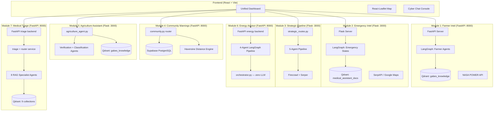
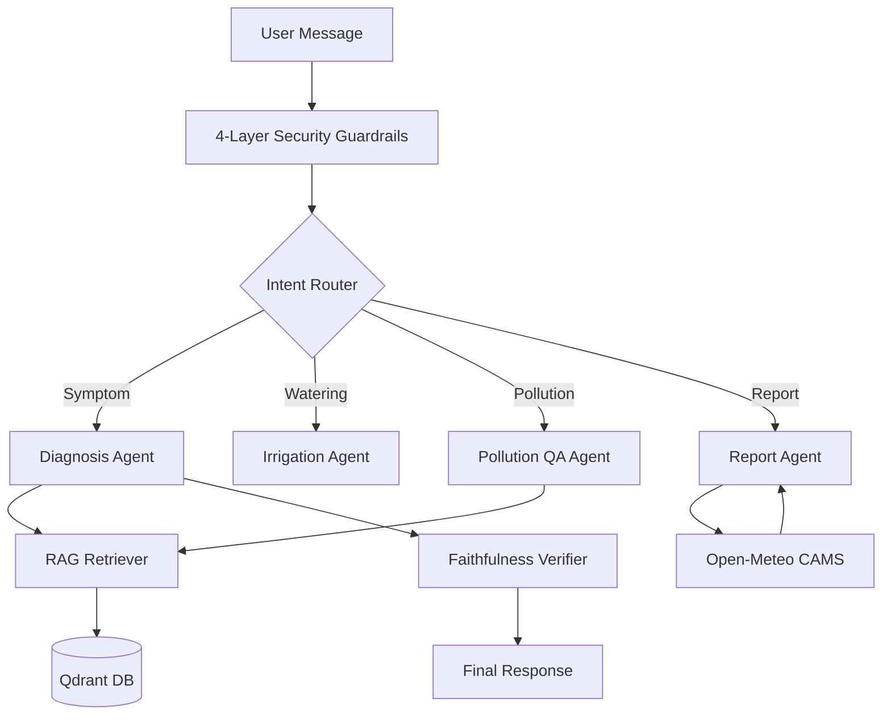
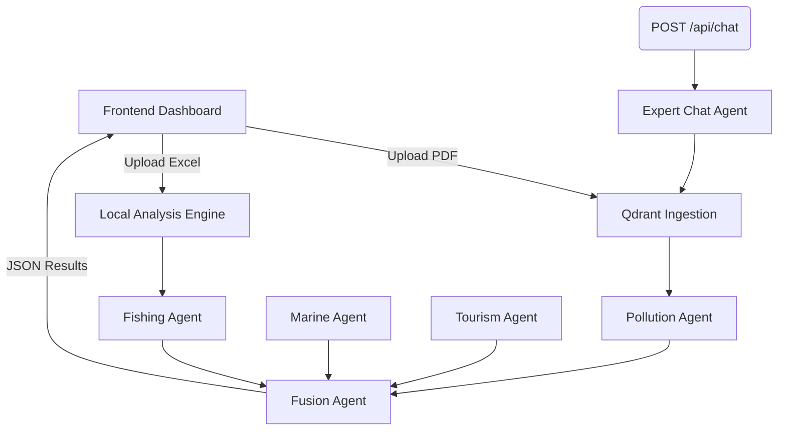
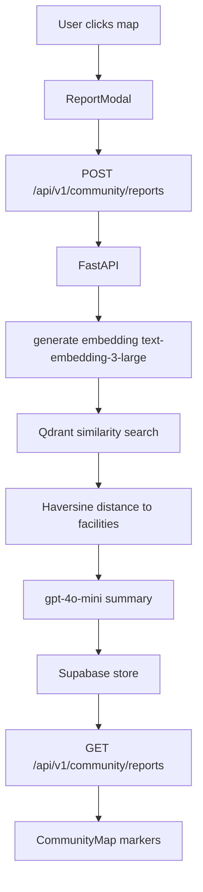
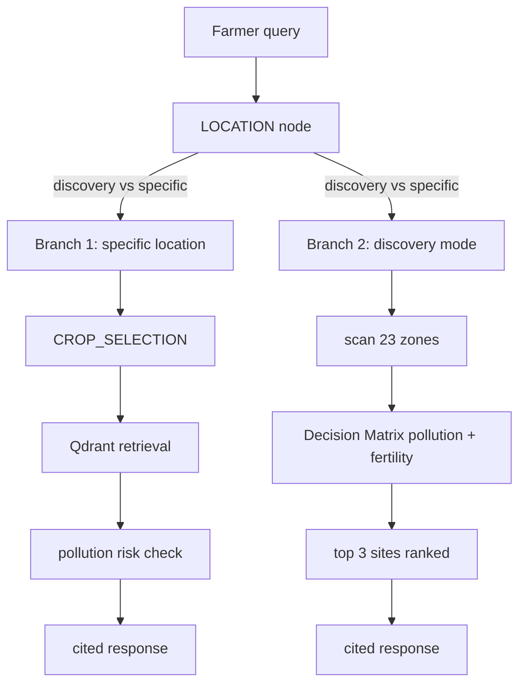
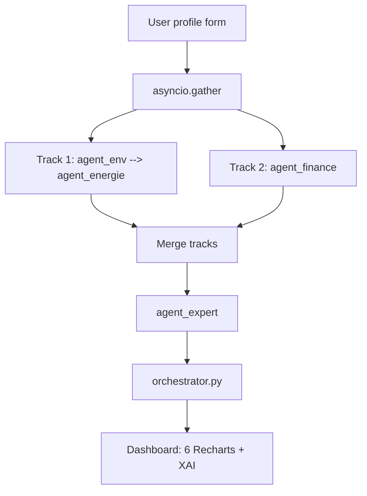
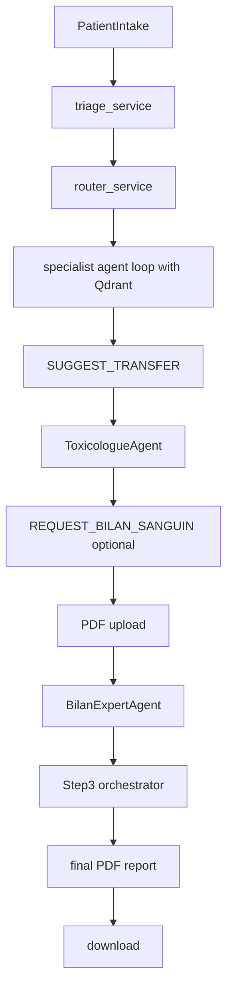
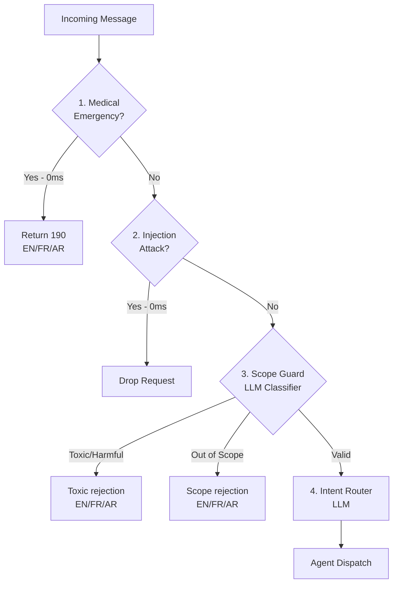
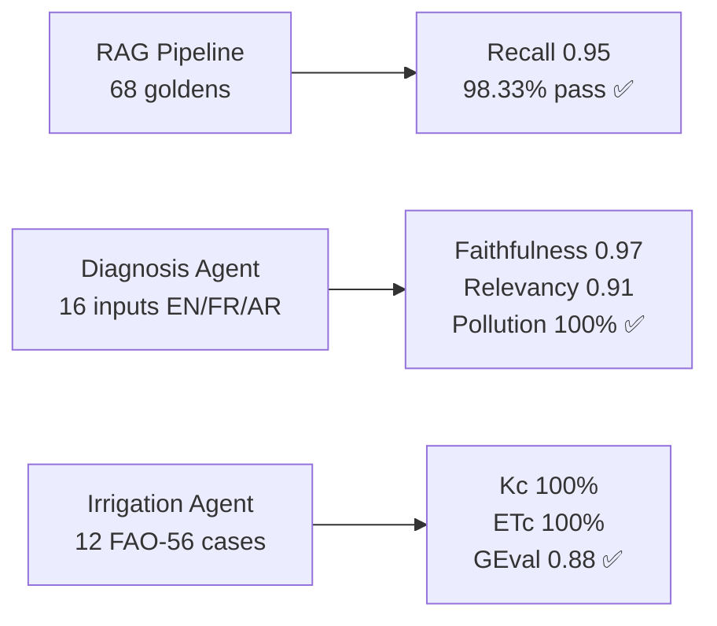

# Gabesi AIGuardian: Unified Environmental Intelligence


**Gabesi AIGuardian** is a unified environmental intelligence and emergency response platform designed specifically for the oasis farmers and residents of Gabès, Tunisia. By integrating real-time NASA satellite data, local industrial CO₂ monitoring, and a RAG-powered medical assistant, the system provides mission-critical advisory and life-saving triage in a region heavily impacted by industrial phosphate processing.

---

## 1. The Problem
The Gabès region faces a multi-decadal environmental crisis centered on the **Groupe Chimique Tunisien (GCT)**.
*   **Phosphogypsum Accumulation**: Over **150 million tonnes** of phosphogypsum have been discharged into the Gulf of Gabès.
*   **Emission Impact**: Current industrial activity generates an estimated economic burden of **76M TD/year** in health and environmental degradation.
*   **Agricultural Decline**: Soil acidification and air toxicity (SO₂, NO₂) have significantly reduced the yield of traditional Deglet Nour date palms and pomegranates.

---

## 2. System Overview
The platform operates as a unified React ecosystem served by a high-performance dual-backend architecture.



---

## 3. Architecture: Farmer Intelligence
The primary advisory engine utilizes a state-of-the-art LangGraph pipeline for precise, evidence-based responses.



---

## Design Decisions & Tradeoffs

| Decision | Choice Made | Alternative Rejected and Why |
| :--- | :--- | :--- |
| Pollution thresholds | P80/P95 rolling 30-day relative bands | WHO absolute 40 μg/m³ threshold — Open-Meteo CAMS regional background values (0.1–3.4 μg/m³) are 20-400× below WHO limit, absolute thresholds would never fire |
| LangGraph node execution | Synchronous def functions | Async — Windows asyncio event loop conflicts with LangGraph on Python 3.12 |
| farmer_context vector storage | Zero-vector [0.0] × 3072 placeholder | Real embeddings — collection is payload-only storage for pollution events, vector search is never performed against it |
| Guardrail toxicity + scope check | Single GPT-4o-mini call returning {is_toxic, is_out_of_scope} | Two parallel calls — same wall-clock latency, 2× API cost, larger failure surface |
| Faithfulness verification | Keyword overlap between claims and retrieved chunks, pure Python | LLM-as-judge — 0ms latency, no additional cost, deterministic |
| Pollution query expansion | Conditional — only when symptom contains proximity signals | Always — unconditional pollution queries before fix returned only generic palm disease docs (scores 0.36-0.45), post-fix scores 0.57-0.63 with 3-6 documents |
| Agriculture agent placement | Ported into emergency_intel Flask server (port 3000) | Separate backend — emergency_intel already owns CO2 pollution risk scores needed by the agriculture decision matrix, colocation avoids cross-service API calls |
| Energy pipeline parallelism | asyncio.gather() for Finance parallel with ENV→Énergie | Full sequential — adds ~15-25s wall clock time with identical output quality |
| Medical triage routing | Confidence gate defaults ambiguous to Generalist | Direct specialist routing — premature specialist assignment on vague symptoms wastes consultation turns and risks missed generalist clarification |

---

## 4. Module 1: Farmer Intel (Diagnostics & Advisory)
A deep-intelligence module for oasis management and scientific diagnostics.

*   **LLM Engine**: `gpt-4o-mini`
*   **Vector Search**: `text-embedding-3-large` (1536 dims)
*   **RAG Infrastructure**:
    *   **Collections**:
        *   `gabes_knowledge`: 1718 chunks, 21 docs, 1536-dim (Core agricultural and environmental documents).
        *   `farmer_context`: 3072-dim zero-vector placeholder, runtime pollution event log.
        *   `satellite_timeseries`: Empty, reserved for future geospatial embeddings.
    *   **Chunker**: Chonkie SemanticChunker (Hybrid: Dense + Sparse BM25/IDF).
*   **Irrigation Engine**:
    *   **Math**: FAO-56 Penman-Monteith methodology.
    *   **Fallback**: Hargreaves-Samani estimation when `ALLSKY_SFC_SW_DWN` = -999.
    *   **Lookback**: 14-day NASA POWER historical weather data (`T2M_MAX`/`T2M_MIN`/`ALLSKY_SFC_SW_DWN`/`WS2M`/`RH2M`).
*   **Pollution Attribution**:
    *   **Reference Coords**: GCT Complex at 33.9089°N, 10.1256°E.
    *   **Relative Thresholds**: Statistical P80/P95 bands based on Open-Meteo CAMS data.
    *   **Exposure Bands**: `near_gct` (~2km), `mid_exposure` (~5km), `lower_exposure` (~10km), `ultra_remote` (>10km).
*   **PDF Dossier Generation**:
    *   **Engine**: `reportlab` (3 pages: Risk Summary, Event Breakdown, Confidence & Limitations).
    *   **Features**: Risk badge (LOW/MODERATE/HIGH), legal disclaimer on every page.

---

## 5. Module 2: Emergency Intel (Triage & Monitoring)
A rapid-response module for medical emergencies and industrial CO₂ tracking.

*   **LangGraph Lifecycle**: `GREETING` → `LOCATION` → `SYMPTOMS` → `FOLLOW_UP` → `ESCALATION` → `LLM_FORMATTER`.
*   **Triage Logic**:
    *   **Escalation Condition**: `emergency_score >= 80`.
    *   **Score Formula**: `(symptom_weight × 0.60) + (pollution_risk × 0.25) + (duration_weight × 0.15)`.
    *   **Symptom Weights**: Deterministic mapping (Chest Pain: 95, Unconscious: 100).
    *   **Secondary Escalation**: `prolonged=True` when user responds "No/Worse" in `FOLLOW_UP`.
    *   **Inactivity Alarm**: A 60-second inactivity alarm triggers automatic escalation to emergency services (190).
*   **Analysis Agent Pipeline**:
    *   **Agent 1 (Analyst)**: Produces structured JSON (`trend`, `seasonalPattern`, `complianceStatus`).
    *   **Agent 2 (Strategist)**: Generates prioritized actions (`critique`, `important`, `souhaitable`).
*   **External APIs**:
    *   **SerpAPI**: Google Maps engine for geocoding text queries. *Note: SerpAPI is optional — system remains fully functional without it.*
    *   **OpenAI**: API provider for LLM and Embeddings.
*   **Monitoring Data**: Monthly CO₂ timeseries for 12 facilities.
    *   **Data Files**: `locations.json`, `usine_A_acide.json` through `usine_E_fluor.json`, `saet_power.json`, `ghannouch_gas.json`, `zone_urban_gabes.json`, `zone_agriculture_chenini.json`.

---

## 6. Module 3: Strategic Pipeline
The Strategic Pipeline is an autonomous environmental intelligence layer designed for regional decision-making.

- **5-agent architecture**: 
    - **Pollution Agent**: Qdrant RAG with dynamic trust scoring to resolve conflicts between multiple industrial PDFs.
    - **Fishing Agent**: Analyzes local Excel/CSV data and performs Serper web searches for real-time market context.
    - **Marine Agent**: Utilizes Open-Meteo live data for the Gulf of Gabès to model wave, wind, and contaminant diffusion.
    - **Tourism Agent**: Evaluates regional reputation and infrastructure impact based on live scraping.
    - **Fusion Agent**: The orchestrator. Synthesizes all 4 agents into a math-linked **Global Risk Score** and generates targeted recommendations for fishermen and authorities.
- **Expert Chat Agent**: Named **"Gabesi"**, this agent features session memory and generates markdown reports, complex data tables, and dynamic trend charts.
- **Data sources**: Dynamic industrial PDF uploads (Qdrant), fishery datasets in `emergency_intel/data_an/`, Open-Meteo marine data, and Firecrawl deep scraping with Serper fallback.
- **Models**: GPT-4o, GPT-4o-mini, and `text-embedding-3-large`.
- **Blueprint**: `strategic_routes.py` Flask Blueprint served on port 3000 alongside emergency intel.

#### Strategic Pipeline Flow


---

## 7. Module 4: Community Warnings Map

*   **Description**: anonymous citizen environmental reporting system, interactive Leaflet map centered on Gabès
*   **Integration**: natively merged into FastAPI Module 1 on port 8000 under /api/v1/community prefix — no new backend process required
*   **AI Pipeline**: report submitted → text-embedding-3-large generates embedding → Qdrant similarity search (cosine ≥ 0.85) finds similar past reports → confidence score computed from cluster density → gpt-4o-mini generates neutral objective summary
*   **Spatial Intelligence**: Haversine distance computed to 14 local GCT industrial facility JSON files in backend/app/data/
*   **Database**: Supabase PostgreSQL, 3 tables — environmental_reports, report_analysis, report_meta (IP hash rate limiting)
*   **Privacy**: anonymous, no login, no personal data, coordinates rounded to ~100m precision for public display
*   **Frontend**: CommunityMap.jsx with react-leaflet marker clustering, color-coded markers by issue type (smoke/smell/dust/water/waste/symptoms), filter panel by type and severity, 30-second polling interval
*   **Issue types**: smoke, smell, dust, water contamination, waste, health symptoms
*   **Severity levels**: low, medium, high



---

## 8. Module 5: Agriculture Assistant

*   **Integration**: ported agriculture_agent.py into emergency_intel/services/, new POST /api/agriculture/chat endpoint on Flask port 3000. Frontend: AgricultureChat.jsx embedded in Emergency.jsx — mutually exclusive with EmergencyChat (opening one minimizes the other), dark green theme with leaf toggle icon
*   **Two pipelines**: Geographic Discovery Pipeline (SerpAPI → AI Verification Agent validates GPS bounds against Gabès governorate → Classification Agent categorizes into industrial/agriculture/coastal/urban → Leaflet map display) and Agriculture Decision Pipeline (LangGraph state machine: LOCATION node detects location vs discovery query → CROP_SELECTION node performs single-pass RAG)
*   **Single-Pass RAG Engine**: one AI turn performs semantic retrieval from gabes_knowledge Qdrant collection + pollution risk score analysis + localized cited response. 3× faster than multi-turn approach
*   **Fast Discovery Mode**: farmer asks "Where can I plant [crop]?" → agent performs global scan of 23 Gabès industrial/agricultural zones, cross-references P80/P95 pollution bands with soil fertility data, returns top 3 optimal planting sites
*   **Source Citation**: every recommendation includes doc_name references from retrieved chunks — prevents hallucination by proving which documents grounded the advice
*   **Models**: GPT-4o-mini for all reasoning, text-embedding-3-large for semantic retrieval from gabes_knowledge
*   **Zero-hallucination design**: LangGraph enforces strict RAG-only responses — agent cannot recommend zones without retrieved evidence



---

## 9. Module 6: GabèsEnergy AI — Renewable Energy Advisor
*   **Purpose**: guides Gabès residents through renewable energy transition — 3000-3200 sun hours/year (top 10% globally), Mediterranean coastal winds ~5 m/s
*   **Pipeline Architecture**: hybrid parallel/sequential via `asyncio.gather()` — Phase 1: `agent_env` → `agent_energie` (sequential) runs parallel with `agent_finance`; Phase 2: `agent_expert` (sequential, receives both); Phase 3: `orchestrator.py` (pure Python, zero LLM, <0.1s). Total: ~25-45s vs ~50-70s without parallelism
*   **Agent ENV** (`agent_env.py`): 3 tools — `analyse_solar_potential` (solar score 0-100: maison type 5-30pts + orientation Sud=25/Est-Ouest=15/Nord=5pts + sun hours ≥3000h=25pts + no existing panels=10pts, max 90pts), `calculate_co2_footprint` (0.48 kg/kWh ANME Tunisia 2022 + transport by vehicle type), `evaluate_energy_efficiency` (A→D rating)
*   **Agent Énergie** (`agent_energie.py`): 3 tools — `match_renewable_sources` (scores 5 technologies: PV/Thermique/Éolien/Biogaz/Géothermie using `score_pv = 0.44×score_soleil + 0.33×score_orientation + 0.23×score_logement`, threshold ≥40/100), `size_installations` (kWp = kWh_annuel/(heures_soleil × 0.80), market price 3200 TND/kWp, PROSOL subsidy 30%), `create_transition_plan` (3 phases: <3 months / 3-12 months / 1-3 years)
*   **Agent Finance** (`agent_finance.py`): 3 tools — `analyse_budget_capacity` (income/expenses/savings/debt ratio), `calculate_solar_roi` (economie_mensuelle = facture_steg × 0.80, payback_mois = cout_net/economie_mensuelle, gains_25_ans = Σ(economie_annuelle × 1.02^year) with +5%/yr STEG historical inflation), `evaluate_energy_savings_plan` (quick wins vs heavy investments). Subsidies: PROSOL Élec 30%, PROSOL Thermique 30%, Crédit BFPME
*   **Agent Expert** (`agent_expert.py`): 4 tools — `web_search_prices` (DuckDuckGo, real 2024 Tunisian market prices), `calculate_personalized_gains` (5/10/25yr projections with -0.5%/yr PV degradation and +5%/yr STEG inflation), `generate_installation_map` (spatial placement per zone: rooftop/balcony/garden), `build_final_report` (★★★★★ scored solution table)
*   **Orchestrator** (`orchestrator.py`): pure Python, zero LLM calls, <100ms — 6 modules: `_financial_projections` (25 data points, 1/year), `_co2_projections` (kg CO₂ avoided with degradation), `_energy_mix` (current 100% STEG vs target % renewable), `_solution_comparison` (score/cost/payback/CO₂ per technology), `_compute_kpis` (12 KPIs for dashboard cards), `_build_xai` (variable weights, decision trees, confidence scores per agent)
*   **XAI Section**: variable importance (sun hours 28%, STEG bill 22%, housing type 18%, solar orientation 15%, renovation budget 10%, ownership 7%), decision trees per agent, confidence scores (ENV 91%, Finance 85%, Énergie 92%, Expert 89%), identified biases and model limits
*   **Frontend**: React 18 + Vite, Recharts 6 charts (AreaChart 25yr financial projections, BarChart annual savings, AreaChart CO₂ reduction, PieChart×2 current vs target energy mix, horizontal BarChart solution comparison, RadarChart multi-criteria score/ROI/budget/CO₂), Leaflet GPS selection limited to Gabès region, Open-Meteo auto-fetch (temperature + sun hours), Nominatim OSM reverse geocoding, JSON profile export
*   **External APIs**: Open-Meteo (free, auto weather), Nominatim OSM (free, GPS→address), DuckDuckGo Instant API (free, real market prices), OpenAI GPT-4o-mini, LangSmith tracing
*   **Models**: gpt-4o-mini for all 4 agents, no embeddings (no vector DB — pure LLM + deterministic orchestration)



---

## 10. Module 7: Gabes Medical Triage
*   **Purpose**: clinical triage and consultation for Gabès industrial exposure risk profiles — structured intake with 20+ clinical/environmental signals, specialist routing with confidence gating, longitudinal patient dossier by CIN, blood-test analysis, downloadable PDF clinical reports
*   **Pipeline**: PatientIntake → triage_service (LLM analysis, domain ranking, urgency) → router_service (confidence gate — defaults to Generalist when unclear) → specialist agent consultation loop → optional handoff via [SUGGEST_TRANSFER: ...] → ToxicologueAgent synthesis → BilanExpertAgent blood test interpretation → Step 3 orchestrator → final PDF report
*   **8 RAG Agents** (all inherit BaseAgent, CIN-linked dossier, Qdrant-backed):
*   GeneralistAgent: first-line when confidence low or symptoms vague, one question/turn, can transfer, collection: generaliste_collection
*   PneumologueAgent: respiratory/pulmonary irritation, mandatory clarification before toxicology transfer unless life-threatening, collection: pneumologue_collection
*   CardiologueAgent: chest pain/palpitations/hemodynamic, mandatory clarification before transfer unless red flag, collection: cardiologue_collection
*   NeurologueAgent: neurological/cognitive/neuromotor, mandatory clarification before transfer unless red flag, collection: neurologue_collection
*   OncologueAgent: oncologic suspicion and workup, mandatory clarification before transfer unless red flag, collection: oncologue_collection
*   DermatologueAgent: chemical/industrial dermatologic manifestations, mandatory clarification before transfer unless red flag, collection: dermatologue_collection
*   ToxicologueAgent: exposure-specific synthesis, treatment pathway, urgency decision, can request blood tests via [REQUEST_BILAN_SANGUIN], collection: toxicologue_collection
*   BilanExpertAgent: blood-test PDF interpretation (markers, toxicology signals, confidence), hands off to toxicologist finalization, collection: bilan_expert_collection

*   **Embeddings**: `text-embedding-3-large`, 3072 dims. Sparse retrieval fallback: FastEmbed SPLADE (`prithivida/Splade_PP_en_v1`)
*   **Qdrant collections** (9 total): `historical_cases` (dossier + chat history + blood test docs + indexed case payloads), `gabes_knowledge`, `generaliste_collection`, `pneumologue_collection`, `cardiologue_collection`, `neurologue_collection`, `oncologue_collection`, `dermatologue_collection`, `toxicologue_collection`, `bilan_expert_collection`
*   **Blood test pipeline**: PDF upload → `pypdf` extraction → Qdrant indexing → `BilanExpertAgent` interpretation → `ToxicologueAgent` integrated synthesis
*   **Step 3 orchestrator**: `BilanExpertAgent` + `ToxicologueAgent` finalization → structured physician PDF (`ReportLab`) → downloadable `report_pdf_url`
*   **Medical History**: `GET /api/patient/history` by CIN returns all previous records, per-record PDF download
*   **Optional**: Supabase metadata sink
*   **Models**: `gpt-4o-mini` (all agents), `text-embedding-3-large` 3072 dims, LangSmith tracing on all agents
*   **Safety design**: router confidence gate defaults ambiguous to Generalist; mandatory clarification before toxicology escalation; final report includes urgency statement for clinician handoff; system is clinical decision-support, not autonomous care



---

## 11. Security & Guardrails
A 4-layer chain protecting the LLM pipeline with ~800ms total latency. LangSmith produces **one unified trace per request**.



| Layer | Type | Latency | Purpose |
| :--- | :--- | :--- | :--- |
| **1. Medical** | Regex/Pattern | 0ms | Detects medical emergencies and returns the 190 emergency number. |
| **2. Injection** | Pattern | 0ms | Detects prompt-injection attempts. |
| **3. Safety** | LLM Classifier | ~400ms | Filters toxicity and out-of-scope requests. |
| **4. Intent** | LLM Classifier | ~400ms | Routes query to correct LangGraph node. |

**Cost per Call:**
*   Blocked request: ~$0.0002
*   Full pipeline: ~$0.0007

---

## 12. Evaluation Results
Validated using **DeepEval** with 68 goldens and 56 mocked unit tests.

### RAG & Diagnosis Performance
| Metric | Value | Success Rate | Notes |
| :--- | :--- | :--- | :--- |
| **Contextual Recall** | 0.9512 | 98.33% | 68 goldens |
| **Contextual Relevancy** | 0.4395 | 41.67% | Known artifact: multi-topic chunks avg 841 chars |
| **Faithfulness** | 0.9667 | 100% | 16 inputs |
| **Answer Relevancy** | 0.9115 | 100% | |
| **Pollution Link Accuracy**| 1.0000 | 100% | 16/16 |

### Irrigation Engine Accuracy
| Metric | Value | Success Rate |
| :--- | :--- | :--- |
| **Kc Lookup Accuracy** | 1.000 | 100% |
| **ETc Math Accuracy** | 1.000 | 100% |
| **GEval (Conversational)** | 0.883 | 100% |
| **No Jargon Violation** | 1.000 | 100% |



---

## 13. API Reference

| Method | Endpoint | Request Shape | Response Shape |
| :--- | :--- | :--- | :--- |
| **POST** | `/api/v1/chat` | `{"message": "str (min 3, max 2000)", "farmer_id": "str|null", "plot_id": "str|null", "language": "en|fr|ar", "crop_type": "date_palm|pomegranate|fig|olive|vegetables", "growth_stage": "initial|mid|end"}` | `{"response": "str", "state": "str"}` |
| **POST** | `/api/v1/diagnosis` | `{"symptom_description": "str (min 10, max 1000)", "language": "en|fr|ar", "farmer_id": "str|null", "plot_id": "str|null"}` | `{"diagnosis": "str", "confidence": float}` |
| **POST** | `/api/v1/irrigation` | `{"crop_type": "date_palm|pomegranate|fig|olive|vegetables", "growth_stage": "initial|mid|end", "language": "en|fr|ar", "farmer_id": "str|null", "plot_id": "str|null"}` | `{"irrigation_depth_mm": float, "et0_mm_day": float, "kc": float, "weather": {...}}` |
| **POST** | `/api/v1/pollution/report` | `{"farmer_id": "str", "plot_id": "str", "language": "en|fr|ar", "window_days": 30}` | `{"events": [...], "risk_level": "str"}` |
| **POST** | `/api/v1/pollution/dossier` | same as /pollution/report, returns application/pdf | PDF binary stream |
| **POST** | `/api/v1/pollution/qa` | `{"question": "str (min 10)", "language": "str"}` | `{"answer": "str", "sources": ["str"]}` |
| **GET** | `/api/v1/health` | None | `{"status": "ok", "collection": "gabes_knowledge", "timestamp": "ISO8601"}` |
| **POST** | `/api/v1/community/reports` | `{"lat": float, "lng": float, "issue_type": "smoke\|smell\|dust\|water\|waste\|symptoms", "severity": "low\|medium\|high", "description": "str"}` | `{"id": "uuid", "ai_summary": "str", "confidence": float, "similar_count": int}` |
| **GET** | `/api/v1/community/reports` | optional query params issue_type and severity | array |
| **GET** | `/api/v1/community/reports/{id}` | None | single report with AI analysis |
| **POST** | `/api/agriculture/chat` | `{"message": "str", "session_id": "str", "location": {"lat": float, "lng": float} | null}` | `{"response": "str", "sources": ["doc_name strings"], "zones_scanned": int | null, "recommended_sites": [...] | null}` |
| **POST** | `/analyse` | Energy module main pipeline (4 agents + orchestrator + dashboard) | {"identite": {...}, "logement": {...}, "consommation": {...}} | {"dashboard": {"kpis": {...}, "financial_projections": [...], "co2_projections": [...], "energy_mix": {...}, "xai": {...}}, "total_time_seconds": float} |
| **POST** | `/analyse/env` | Energy ENV agent only | same profile shape | env_result |
| **POST** | `/analyse/finance` | Energy Finance agent only | same profile shape | finance_result |
| **POST** | `/triage` | Medical intake analysis + router decision | PatientIntake (20+ fields) | RouterDecision (specialty, urgency) |
| **POST** | `/api/chat` | Medical multi-agent consultation turn | {"cin": "str", "message": "str", "agent": "str"} | {"response": "str", "transfer": "str|null", "bilan_request": bool} |
| **POST** | `/api/bilan/upload` | Upload and index blood test PDF | multipart (cin + file) | {"status": "str", "next_agent": "str"} |
| **POST** | `/api/step3/finalize` | BilanExpert + Toxicologist finalization | {"cin": "str"} | {"bilan_analysis": "str", "toxicology_final": "str", "report_pdf_url": "str"} |
| **GET** | `/api/step3/report/pdf?cin=` | Download final clinical PDF | None | PDF binary stream |
| **GET** | `/api/patient/history?cin=` | All previous dossier records for CIN | None | records array |
| **GET** | `/api/patient/history/report/pdf?cin=&case_id=` | Download historical case PDF | None | PDF binary stream |

---

## 14. Setup & Installation

### Backend Services
Both modules share one merged `requirements.txt` located at `backend/requirements.txt`.
Supabase setup required for Module 4: run schema.sql in your Supabase SQL Editor to initialize environmental_reports, report_analysis, and report_meta tables.
Module 4 requires SUPABASE_URL and SUPABASE_KEY in backend/.env — see .env.example.

**Terminal 1: FastAPI (Module 1)**
```cmd
cd backend
python -m venv .venv
.venv\Scripts\activate
pip install -r requirements.txt
uvicorn app.main:app --reload --port 8000
```

**Terminal 2: Flask (Module 2 & 3)**
```cmd
cd emergency_intel
.venv\Scripts\activate
python app.py
```

### Frontend (React + Vite)
**Terminal 3: React Dashboard**
```cmd
cd frontend
npm install
npm run dev
```

---

## 15. Project Structure
```text
.
├── backend/                   # FastAPI Server (Module 1)
│   ├── app/
│   │   ├── agents/            # LangGraph Implementation
│   │   ├── routers/community.py    # Community reports router
│   │   ├── services/          # NASA/CAMS/Qdrant Connectors
│   │   │   └── community_service.py  # AI pipeline + Haversine
│   │   ├── data/                  # 14 GCT industrial facility JSON files
│   │   └── guardrails/        # 4-Layer Chain
│   ├── tests/                 # DeepEval Test Suite
│   └── requirements.txt       # Unified dependencies
├── emergency_intel/           # Flask Server (Module 2 & 3)
│   ├── strategic_routes.py    # Flask Blueprint for strategic pipeline
│   ├── data_an/               # Fishery Excel files and industrial PDF templates
│   ├── services/              # Triage, Strategic Agents & Analysis
│   │   └── agriculture_agent.py    # LangGraph agriculture RAG agent.
│   ├── data/                  # CO2 JSON Timeseries
│   └── app.py                 # Port 3000 Entry
├── energierenouv/             # FastAPI Energy Advisor (Module 6)
│   ├── backend/
│   │   ├── main.py            # FastAPI + pipeline orchestration
│   │   ├── orchestrator.py    # Pure Python stats + XAI (zero LLM)
│   │   └── services/
│   │       ├── agent_env.py       # Environmental agent (3 tools)
│   │       ├── agent_finance.py   # Finance agent (3 tools)
│   │       ├── agent_energie.py   # Energy agent (3 tools)
│   │       └── agent_expert.py    # Expert synthesis agent (4 tools)
│   └── frontend/              # React + Recharts dashboard
├── med/                       # FastAPI Medical Triage (Module 7)
│   ├── main.py                # FastAPI app + step3 orchestrator
│   ├── agents/                # 8 RAG specialist agents
│   │   ├── base.py
│   │   ├── generalist_agent.py
│   │   ├── pneumologue_agent.py
│   │   ├── cardiologue_agent.py
│   │   ├── neurologue_agent.py
│   │   ├── oncologue_agent.py
│   │   ├── dermatologue_agent.py
│   │   ├── toxicologue_agent.py
│   │   └── bilan_expert_agent.py
│   └── services/              # triage, router, RAG, persistence
├── frontend/                  # Unified React Frontend
│   ├── src/
│   │   ├── components/        # Glass-morphic UI components
│   │   │   └── emergency/AgricultureChat.jsx    # Agriculture assistant with dark green theme
│   │   ├── pages/             # Dashboard, Irrigation
│   │   │   └── Emergency.jsx  # includes AgricultureChat.jsx integration
│   │   └── i18n/              # Lang files (EN/FR/AR)
│   └── vite.config.js         # Port Proxying Config
└── README.md
```

---

## 16. Roadmap
- [x] Integrate LangGraph state machines for complex multi-agent flows
- [x] Build and test 4-layer security guardrail chain
- [x] Connect robust RAG pipeline via Qdrant with hybrid semantic chunking
- [x] Develop precise FAO-56 math engine with NASA POWER historical weather data
- [x] Deploy modular UI with Vite and React
- [x] Merge legacy Emergency Intelligence Flask module
- [x] Strategic Pipeline — 5-agent environmental analysis
- [x] Expert Chat "Gabesi" — session memory, markdown reports, data tables
- [x] Firecrawl + Serper hybrid web intelligence
- [x] Community Warnings Map — anonymous citizen reporting, Supabase, Qdrant similarity, gpt-4o-mini summaries.
- [x] Agriculture Assistant — LangGraph RAG agent, single-pass retrieval, 23-zone pollution/fertility decision matrix, source citation
- [x] GabèsEnergy AI — 4-agent parallel LangGraph pipeline, 25yr financial projections, XAI explainability, PROSOL subsidy modeling
- [x] Medical Triage — 8 RAG specialist agents, CIN dossier, blood test pipeline, clinical PDF reports, confidence-gated routing
- [ ] Run end-to-end pipeline GEval at scale
