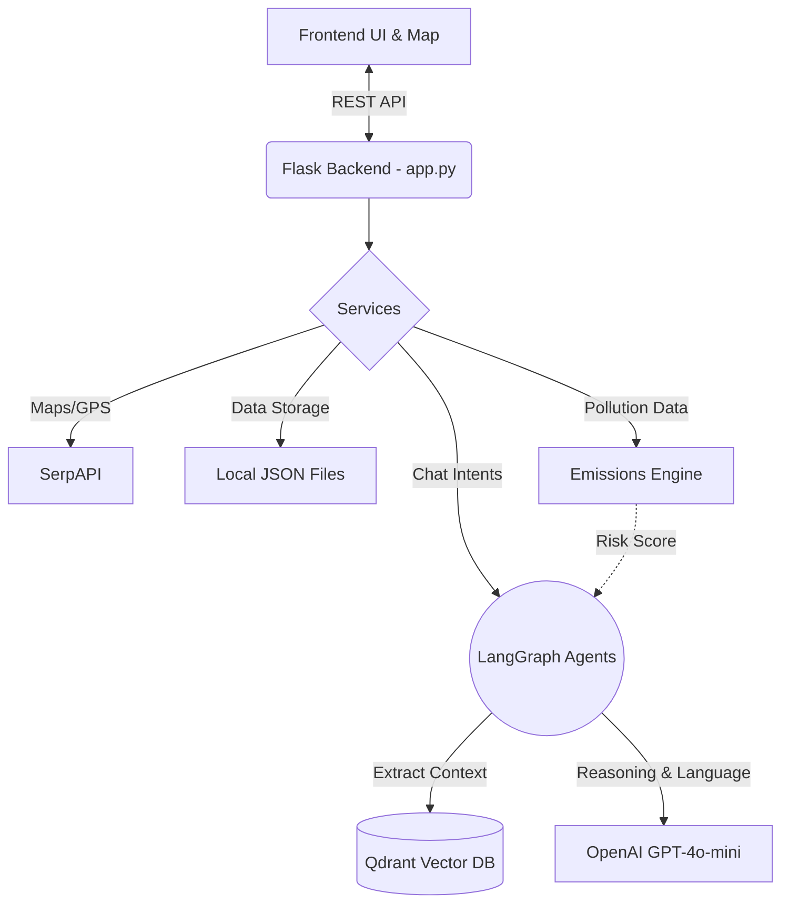

# 🌍 Gabesi AIGuardian — Smart Environmental & Agriculture Intelligence Platform

An AI-powered geographic and agricultural intelligence system for **Gabès, Tunisia**. It actively collects, verifies, and maps strategic industrial and geographical zones, whilst empowering local farmers with a highly-reactive **AI Agriculture Assistant** equipped with real-time pollution metrics and agricultural RAG logic.

---

## 🎯 Project Overview & Pipeline

This platform performs two critical pipelines:

### 1. Geographic Discovery & Mapping Pipeline
1. **Searches** locations via SerpAPI (Google Maps engine) to get GPS coordinates.
2. **Verifies** each location is genuinely in Gabès (AI Verification Agent).
3. **Classifies** each location into a specific category (OpenAI GPT-4o-mini).
4. **Detects duplicates** via coordinate proximity.
5. **Displays** all filtered zones dynamically on a custom Leaflet map dashboard.

### 2. Agriculture Decision Pipeline (The Assistant)
1. **User Interaction**: Farmer accesses a glassmorphism floating chat widget.
2. **Location Risk Contexting**: Widget auto-detects or allows map-clicking to cross-reference the farm location with the nearest industrial pollution facilities and calculates a soil/air risk score. The assistant updates dynamically whenever a new location is selected.
3. **Intent Detection**: The Chatbot uses a lightweight LLM router to strictly classify the agricultural intent (e.g., target crop suitability, companion planting).
4. **RAG Extraction**: The Agent queries a high-speed vector database (**Qdrant** - `gabes knowledge` collection) containing embedded agricultural protocols to extract exact planting, soil, and water procedures without hallucination.
5. **Smart Scoring & Fallbacks**: Calculates an industrial risk score (out of 100). If the RAG/LLM connection fails, it falls back to a robust built-in library of Gabesi agricultural rules tailored to the pollution score.

---

## 🗺️ Roadmap

- [x] **Phase 1:** Core Flask Backend & SerpAPI Integration for Map building.
- [x] **Phase 2:** Langchain Verification and Classification (Isolate out-of-scope GPS hits).
- [x] **Phase 3:** Qdrant Vector DB Agricultural injection (`gabes knowledge`).
- [x] **Phase 4:** LangGraph State Machine for strict AI agricultural guidance (Zero-hallucination RAG).
- [x] **Phase 5:** Conversational Memory LLM integration + UI Location Risk Updates + Local logic Fallbacks.
- [ ] **Phase 6:** Remote sensor API integrations for live soil data.
- [ ] **Phase 7:** Multimodal inputs (Farmer can upload a picture of a diseased crop or soil sample).

---

## 🧠 AI Architecture

### Smart Mapping Agents
- **Agent 1 (Classification)**: Asserts categories (`industrial`, `agriculture`, `coastal`, `urban`).
- **Agent 2 (Verification)**: Validates bounds against the Gabès governorate.

### Agriculture Decision Agents (LangGraph)
- **Node: Detection**: Translates natural phrases ("Where can I grow apples?") into standard target crops.
- **Node: RAG Query / Analysis**: `search_qdrant` interface to extract soil/water protocols based on crop choice, merging physical location distance from toxic sites.
- **Node: LLM Formatter**: Wraps static steps and risk alerts into multi-lingual, accessible messages keeping technical guidelines intact and translating them to the user's spoken language.

---

## 🧱 Tech Stack

| Component | Technology |
|-----------|-----------|
| Backend | Python 3.12, Flask, LangGraph |
| Map APIs | SerpAPI, Leaflet.js |
| AI / LLM | OpenAI GPT-4o-mini, LangChain |
| Vector DB | Qdrant (Cloud) |
| Frontend | HTML5, Vanilla JS, CSS3 (Glassmorphism) |

---

## 🏗️ Execution Flow & Use Cases

### Example Use Case 1: High Pollution Risk Assessment
1. User opens the application and clicks **"Use my location"** or selects a point in the Assistant.
2. The agent notes the user is within 5km of the Gabès Chemical Group (GCT) with a high pollution risk score (>60).
3. User asks: *"Can I grow sensitive crops like apples here?"*.
4. **Agent Action:** RAG queries Qdrant for apple requirements, checks the pollution score, and issues a ⚠️ **WARNING**. Explains that soil contamination makes it risky and suggests pollution-tolerant alternatives like dates, capers, or olives instead.

### Example Use Case 2: Identifying Best Zones
1. User accesses the widget and asks *"Where are the good areas for olives?"*.
2. **Agent Action:** Extracts the olive planting protocols and geographic suitability from Qdrant.
3. Returns a structured report recommending Mareth and Matmata hillsides due to well-drained slopes, completely bypassing high-risk industrial zones and providing companion planting tips.

---

## ⚙️ Setup & Installation

### Prerequisites
- Python 3.10+
- SerpAPI key (serpapi.com)
- OpenAI API key (platform.openai.com)
- Qdrant Cluster URL and Key (qdrant.tech)

### Instructions

```bash
# Clone the repository
git clone https://github.com/omarfh111/Gabesi-AIGuardian.git
cd Gabesi-AIGuardian
git checkout backend-map-service

# Create and activate virtual environment
python -m venv venv
.\venv\Scripts\activate   # Windows
# source venv/bin/activate  # Linux/Mac

# Install dependencies (incorporating LangGraph & LangChain ecosystem)
pip install -r requirements.txt

# Configure environment
cp .env.example .env
# Edit .env and add your OPENAI, SERPAPI, and QDRANT keys.
```

---

## 🚀 Execution

### 1. Vector DB Ingestion (One-time)
If this is a fresh setup, you must ingest the agricultural PDFs/documents into Qdrant first.
```bash
python scriptinjection/inject_data.py
```

### 2. Start the Server
```bash
python app.py
```
The server starts on `http://localhost:3000`. Navigate there in your browser to access the Gabès Dashboard and the AI Agriculture Widget!

---

## 🏗️ Architecture Diagram



---

## 📝 License
Proprietary project developed for advanced geographic and agricultural environmental analysis of the Gabès region in Tunisia.
