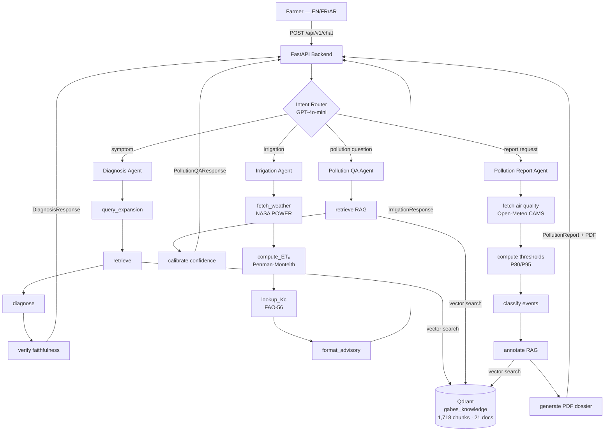
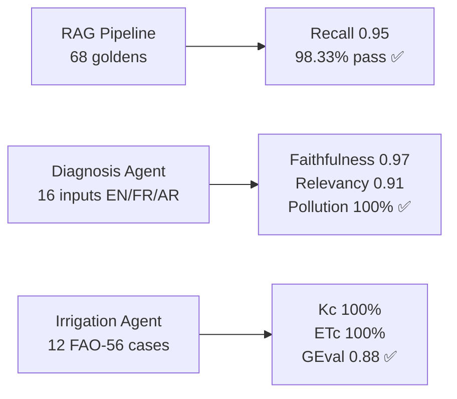

<div align="center">

# 🌿 Gabesi AIGuardian

**An agentic AI system that gives Gabès oasis farmers real-time environmental
intelligence — crop diagnostics, irrigation guidance, and pollution exposure
tracking — powered by RAG, LangGraph agents, and a grounded scientific
knowledge base.**

[](https://python.org)
[](https://github.com/langchain-ai/langgraph)
[](https://fastapi.tiangolo.com)
[](https://qdrant.tech)
[](https://deepeval.com)
[](https://github.com/omarfh111/Gabesi-AIGuardian)
[](https://github.com/omarfh111/Gabesi-AIGuardian/tree/main/frontend)
[](LICENSE)

</div>

---

## 🌍 The Problem

Gabès, Tunisia is home to the **only coastal oasis in the Mediterranean** — and
it is being destroyed. The Tunisian Chemical Group (GCT) has discharged over
150 million tonnes of phosphogypsum into the Gulf since 1972. SO₂, fluoride,
and heavy metals blanket the oasis zones. Soil salinity rises every year.

The environmental cost: **76 million Tunisian dinars per year**.
The farmers who bear this cost have **zero access to the data that documents it**.

---

## 💡 What Gabesi AIGuardian Does

A farmer opens the app and types: *"Why are my palm trees yellowing?"*

The system automatically:
1. Classifies the intent — diagnosis, irrigation, pollution question, or report request
2. Routes to the correct specialized agent
3. Retrieves grounded evidence from scientific papers, municipal audits, and EU reports
4. Returns a plain-language response in the farmer's language (Arabic, French, or English)
5. For pollution events — generates a timestamped PDF dossier the farmer can use as evidence

No other system does this for Gabès.

---

## 🏗️ Architecture



## 🖥️ Demo

| View | What it shows |
|---|---|
| **Chat** | Farmer types a symptom → DiagnosisCard with pollution link badge, confidence score, and cited sources |
| **Chat** | Farmer asks about irrigation → IrrigationCard with daily depth in mm and weather data |
| **Chat** | Farmer asks about pollution → PollutionQACard with RAG-grounded answer |
| **Chat** | Farmer requests report → PollutionReportCard with Download PDF button |
| **Pollution** | Leaflet map centered on GCT (33.9089°N, 10.1256°E) with concentric exposure zone overlays, 30-day event log, SO₂ trend chart |
| **Irrigation** | Crop selector → real-time FAO-56 ET₀ calculation using NASA POWER weather data |

---

## ⚡ Key Capabilities

| Agent | Trigger | Output |
|---|---|---|
| **Diagnosis** | Crop symptom description | Grounded diagnosis, pollution link, cited sources |
| **Irrigation** | Watering question | FAO-56 ET₀ calculation, daily irrigation depth in mm |
| **Pollution QA** | General pollution question | RAG-grounded answer with confidence calibration |
| **Pollution Report** | Report/dossier request | Full PDF dossier with event timeline, risk badge, recommendations |

**All agents support Arabic, French, and English.**

---

## 🌫️ Pollution Intelligence

The pollution agent transforms regional atmospheric data into farm-level evidence dossiers.

- **Deterministic modeling** — no LLM hallucinations in the risk calculation
- **Exposure band classification** — near_gct → mid_exposure → lower_exposure → ultra_remote
- **Rolling percentile thresholds** — P80/P95 over 30-day window (relative background, not WHO absolute)
- **RAG-grounded annotations** — each pollution event cites peer-reviewed evidence
- **PDF export** — professional dossier with risk badge, event breakdown, and legal disclaimer

---

## 🧠 Why This Is Different

| Property | This system | Generic AI assistant |
|---|---|---|
| Pollution attribution | Conditional — only when symptom signals warrant it | Always mentions pollution |
| Faithfulness | Hard-verified — response rejected if < 50% claims grounded | No check |
| Pollution modeling | Deterministic P80/P95 thresholds | LLM estimation |
| Narrative generation | Template-based for legal-sensitive outputs | LLM free-form |
| Confidence | Explicitly calibrated and communicated | Rarely stated |
| Domain specificity | Gabès oasis, GCT complex, Deglet Nour palms | Generic agriculture |

---

## 📂 Project Structure

```
Gabesi-AIGuardian/
├── backend/
│   ├── app/
│   │   ├── main.py                    # FastAPI, lifespan, CORS
│   │   ├── config.py                  # Pydantic BaseSettings
│   │   ├── agents/
│   │   │   ├── intent_router.py       # GPT-4o-mini classifier → agent dispatch
│   │   │   ├── diagnosis_agent.py     # query_expansion → retrieve → diagnose → verify
│   │   │   ├── irrigation_agent.py    # NASA POWER → ET₀ → Kc → advisory
│   │   │   ├── pollution_agent.py     # Open-Meteo → thresholds → classify → RAG → PDF
│   │   │   └── pollution_qa_agent.py  # RAG → confidence calibration → answer
│   │   ├── api/routes.py              # All endpoints
│   │   ├── models/
│   │   │   ├── chat.py
│   │   │   ├── diagnosis.py
│   │   │   ├── irrigation.py
│   │   │   ├── pollution.py
│   │   │   └── pollution_qa.py
│   │   ├── services/
│   │   │   └── pdf_generator.py       # Pollution dossier PDF
│   │   └── rag/retriever.py
│   ├── tests/                         # 51 tests, 0 failures
│   └── requirements.txt
├── frontend/                          # React + Vite farmer-facing UI
│   ├── src/
│   │   ├── pages/
│   │   │   ├── Chat.jsx               # Unified chat — intent-aware response cards
│   │   │   ├── Pollution.jsx          # Leaflet map + exposure dashboard + PDF download
│   │   │   └── Irrigation.jsx         # Crop form + FAO-56 advisory result
│   │   ├── components/
│   │   │   ├── chat/                  # DiagnosisCard, IrrigationCard,
│   │   │   │                          # PollutionQACard, PollutionReportCard
│   │   │   ├── pollution/             # PollutionMap, TrendChart, EventsTable
│   │   │   └── irrigation/            # CropForm, AdvisoryCard
│   │   ├── i18n/                      # en.json, fr.json, ar.json
│   │   └── hooks/                     # useChat, usePollution, useIrrigation
│   └── package.json
├── data/                              # Gitignored — large corpus files
│   └── structured/                    # JSON files (committed)
├── eval_data/                         # Gitignored
├── eval_results/                      # Gitignored
├── scripts/
│   ├── preprocess_docx.py
│   ├── ingest.py
│   ├── smoke_test.py
│   ├── evaluate_retrieval.py
│   ├── evaluate_diagnosis.py
│   └── evaluate_irrigation.py
├── .env.example
└── README.md
```

---

## 🚀 Setup

### Prerequisites

- Python 3.12
- [Qdrant Cloud](https://cloud.qdrant.io) account (free tier works)
- OpenAI API key

### Installation

```bash
git clone https://github.com/omarfh111/Gabesi-AIGuardian.git
cd Gabesi-AIGuardian

python -m venv .venv
.venv\Scripts\activate      # Windows
# source .venv/bin/activate  # Mac/Linux

pip install -r backend/requirements.txt
```

### Environment

```bash
cp .env.example .env
# Fill in: QDRANT_URL, QDRANT_API_KEY, OPENAI_API_KEY,
#          LANGCHAIN_API_KEY, LANGCHAIN_PROJECT=Gabes
```

### Run the Backend

```bash
cd backend
uvicorn app.main:app --reload --port 8000
# Swagger UI: http://localhost:8000/docs
```

### Run the Frontend

```bash
cd frontend
npm install
npm run dev
# UI: http://localhost:5173
```

The frontend connects to the backend at http://localhost:8000 by default.
To change this, set `VITE_API_URL` in `frontend/.env`.

**Pages:**
- `/` — Chat interface: type any question in EN/FR/AR, get an intent-aware response
- `/pollution` — Pollution dashboard: Leaflet map with GCT exposure zones,
  30-day event log, SO₂ trend chart, PDF dossier download
- `/irrigation` — Irrigation advisory: select crop and growth stage,
  get a FAO-56 calculated daily water recommendation

### Reproduce the Knowledge Base

```bash
python scripts/preprocess_docx.py   # PDL Gabès docx → markdown, 41 tables
python scripts/ingest.py            # chunk + embed + upsert to Qdrant
python scripts/smoke_test.py        # verify retrieval works
```

---

## 📊 Knowledge Base

| Collection | Documents | Chunks | Purpose |
|---|---|---|---|
| `gabes_knowledge` | 21 | 1,718 | Static domain RAG |
| `satellite_timeseries` | — | 0* | Weekly oasis snapshots |
| `farmer_context` | — | runtime | Per-farmer pollution event log |

**Ingestion specs:** `text-embedding-3-large` · Chonkie SemanticChunker ·
dense + sparse (BM25/IDF) vectors · payload indexes on `source_type`,
`language`, `doc_name`

**Corpus includes:**
- PDL Gabès 2023 — full municipal audit (French, 41 tables preserved)
- 6 peer-reviewed papers — fluoride damage, heavy metals, phosphate pollution,
  date palm diseases, soil salinity, remote sensing
- 9 EU environmental project reports — ADMIRE, CIGEN, OASIS AQUATIQUE
- FAO-56 Allen 1998 — irrigation reference
- Arabic strategic study 2015-2035
- 3 structured JSON files — oasis zones, GCT coordinates, FAO-56 crop coefficients

---

## 📈 Evaluation Results

### Retrieval Pipeline

68 synthetic goldens · GPT-4o-mini judge · stratified by source type

| Metric | Score | Pass Rate | Status |
|---|---|---|---|
| Contextual Recall | **0.9512** | **98.33%** | ✅ Target met |
| Contextual Relevancy | 0.4395 | 41.67% | ⚠️ Known limitation* |

*Multi-topic chunks (avg 841 chars) are penalised by ContextualRelevancyMetric.
Recall is the operationally meaningful metric — it confirms the right information
is retrieved for 98% of queries.

### Diagnosis Agent

16 synthetic inputs (EN/FR/AR) · GPT-4o-mini judge

| Metric | Score | Pass Rate | Status |
|---|---|---|---|
| Faithfulness | **0.9667** | **100%** | ✅ |
| Answer Relevancy | **0.9115** | **100%** | ✅ |
| Pollution Link Accuracy | **100%** | **16/16** | ✅ |

Key design: conditional pollution queries — only generated when symptom contains
proximity signals (factory smell, white crust, multiple plots affected).

### Irrigation Agent

12 hardcoded FAO-56 test cases · GPT-4o-mini GEval

| Metric | Score | Pass Rate | Status |
|---|---|---|---|
| Kc Accuracy | **1.000** | **100%** | ✅ |
| ETc Math Consistency | **1.000** | **100%** | ✅ |
| No Technical Jargon | **1.000** | **100%** | ✅ |
| Advisory Quality (GEval) | **0.883** | **100%** | ✅ |



---

## 🛠️ API Reference

### `POST /api/v1/chat` — Unified Chat Endpoint

The primary endpoint. Takes any free-text message, classifies intent,
routes to the correct agent, and returns a structured response.

**Request:**
```json
{
  "message": "My date palm leaves are turning yellow and there is white powder on the soil",
  "farmer_id": "farmer_001",
  "plot_id": "bahria_plot_a",
  "language": "en",
  "crop_type": "date_palm",
  "growth_stage": "mid"
}
```

**Response:**
```json
{
  "intent": "diagnosis",
  "agent_used": "diagnosis_agent",
  "response": { ... },
  "processing_time_ms": 9192,
  "timestamp": "2026-04-17T22:32:42Z"
}
```

Possible `intent` values: `diagnosis` · `irrigation` · `pollution_qa` ·
`pollution_report` · `unknown`

---

### `POST /api/v1/diagnosis`

```json
{
  "symptom_description": "Leaves yellowing at tips, white crust on soil",
  "language": "en",
  "farmer_id": "farmer_001",
  "plot_id": "bahria_plot_a"
}
```

Returns `DiagnosisResponse` with `probable_cause`, `confidence`, `severity`,
`pollution_link`, `sources`, `faithfulness_verified`.

---

### `POST /api/v1/irrigation`

```json
{
  "crop_type": "date_palm",
  "growth_stage": "mid",
  "language": "en"
}
```

Returns `IrrigationResponse` with `et0_mm_day`, `kc`, `etc_mm_day`,
`irrigation_depth_mm`, `advisory_text`, `rs_estimated`.

---

### `POST /api/v1/pollution/report`

```json
{
  "farmer_id": "farmer_001",
  "plot_id": "bahria_plot_a",
  "language": "en",
  "window_days": 30
}
```

Returns `PollutionReport` with events, insights, recommendations, narrative,
disclaimer. Events are also logged to Qdrant `farmer_context` collection.

---

### `POST /api/v1/pollution/dossier`

Same request as `/pollution/report`. Returns `application/pdf` — a
professionally formatted 3-page dossier with risk badge, event timeline,
confidence assessment, and legal disclaimer.

---

### `POST /api/v1/pollution/qa`

```json
{
  "question": "How does SO2 from the GCT factory affect date palm trees?",
  "language": "en"
}
```

Returns `PollutionQAResponse` with `answer`, `confidence`, `sources`,
`limitations`.

---

### `GET /api/v1/health`

```json
{"status": "ok", "collection": "gabes_knowledge", "timestamp": "..."}
```

---

## 🗺️ Roadmap

- [x] Knowledge base — 1,718 chunks, 21 docs, dense + sparse vectors
- [x] Retrieval evaluation — Recall 0.95, 98.33% pass rate
- [x] Feature 2: Symptom Diagnosis — LangGraph, RAG, faithfulness verification
- [x] Feature 2 evaluation — Faithfulness 0.97, Relevancy 0.91, PollutionLink 100%
- [x] Feature 3: Irrigation Advisory — NASA POWER + FAO-56 Penman-Monteith
- [x] Feature 3 evaluation — Kc 100%, ETc 100%, GEval 0.88
- [x] Feature 5: Pollution Exposure Logger — P80/P95 thresholds, RAG annotations, Qdrant logging
- [x] Feature 5b: Pollution QA Agent — RAG-grounded Q&A, confidence calibration
- [x] Feature 5c: PDF Dossier Generator — professional evidence document
- [x] LangSmith tracing — full pipeline observability, ~$0.0004/call
- [x] Intent Router — unified /api/v1/chat, 51 tests passing
- [x] React frontend — chat interface (EN/FR/AR), pollution map with exposure zones,
  irrigation advisory, PDF dossier download
- [ ] End-to-end evaluation — full pipeline GEval at scale

---

## 🌱 Why This Matters

Gabès farmers have watched their oasis disappear for 50 years with no data,
no evidence, and no recourse. Gabesi AIGuardian gives them both: a daily
intelligence feed about their own land, and an automatically generated
pollution dossier they can bring to a meeting, a journalist, or a court.

The invisible becomes visible. The anecdotal becomes documented.

---

## 📄 License

MIT License — see [LICENSE](LICENSE) for details.

---

<div align="center">
Built for the farmers of Gabès, Tunisia 🌴
</div>
