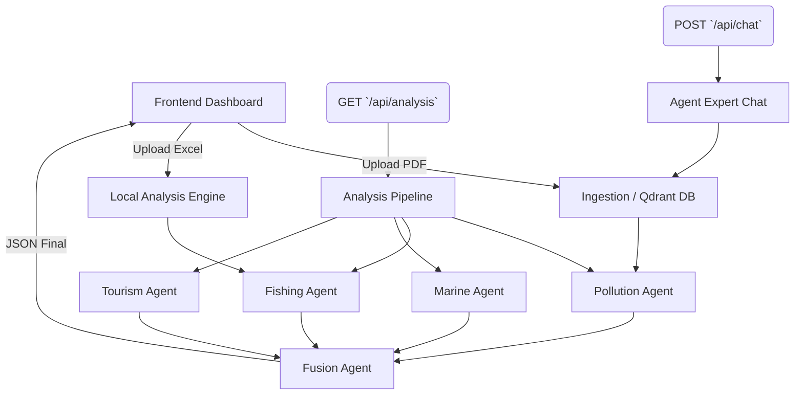

# Gabesi-AIGuardian 🌍🤖

**Gabesi-AIGuardian** est une plateforme d'intelligence environnementale autonome conçue pour la région de Gabès. Elle offre une surveillance intelligente de la pollution industrielle, l'analyse prédictive de la pêche, l'impact sur le tourisme, et l'analyse météorologique marine via un Dashboard interactif et un Agent Conversationnel Expert.

---

## 🏗️ Architecture Complète

Gabesi-AIGuardian repose sur une architecture découplée (Frontend/Backend) avec une chaîne logistique de traitement d'Intelligence Artificielle modulaire (Agentic Pipeline).

### Technologies Utilisées
*   **Frontend** : React (Vite), TailwindCSS, Recharts (Visualisation des données), Lucide-React (Icônes), React-Markdown (Rendu expert GFM).
*   **Backend** : Flask / Werkzeug (Python).
*   **Intelligence Artificielle** : OpenAI (GPT-4o, GPT-4o-mini, text-embedding-3-large).
*   **Vector Database (RAG)** : Qdrant (pour l'ablation documentaire et la récupération).
*   **Outils d'Agents** : Serper API (Recherche Web en temps réel), Pandas (Traitement CSV/Excel), PyMuPDF (Extraction PDF).

---

## 🗄️ Sources de Données

1.  **Industrie (RAG)** : Documents PDF (ex: rapports d'audits, documents contradictoires) uploadés dynamiquement à travers l'interface graphique. Ces données sont converties en Embeddings dans Qdrant.
2.  **Pêche** : Tableurs (Excel / CSV) multi-fichiers listant les flottes, les productions et les infrastructures.
3.  **Météo Marine** : Fichiers JSON dynamiques provenant de l'API Open-Meteo.
4.  **Tourisme** : Données extraites de scraping web et logs régionaux.

---

## 🧠 L'Architecture du Pipeline (Data Flow)



---

## 🤖 Description des Agents

L'approche adoptée est **Multi-Agent**. Le backend délègue la logique à différents agents isolés.

*   **Pollution Agent** : Son rôle est d'interroger la base Qdrant pour extraire les capacités de production industrielles et repérer les niveaux de pollution. *Particularité* : Il est doté d'une logique de gestion de conflit de données pour prioriser et équilibrer l'information en cas d'upload de PDF contradictoires (Système de confiance dynamique).
*   **Fishing Agent** : Lit et analyse les données Excel locales et exécute des recherches web complémentaires via Serper API pour relier les données brutes à la réalité terrain (qualité des poissons de Gabès, interdictions).
*   **Marine Agent** : Analyse algorithmique des flux météorologiques pour mesurer l'impact de la direction des vents (diffusion des contaminants) et la houle marine.
*   **Tourism Agent** : Agnostique, interroge les données de réputation touristique et juge du statut structurel (Impact de l'infrastructure).
*   **Fusion Agent** : Le Chef d'Orchestre. Il récupère les conclusions des 4 agents pour générer un **Global Risk Score** mathématiquement lié à la gravité et rédige des recommandations ciblées pour les pêcheurs et les autorités.
*   **Agent Chat Expert** : En mode "conversation active" (dispose d'une mémoire de session), il analyse l'historique et génère des tableaux de synthèses chiffrées selon une grammaire stricte.

---

## 🚀 Procédure d'Exécution (Installation)

### 1. Cloner le Repository et Configuration
```bash
git clone https://github.com/omarfh111/Gabesi-AIGuardian.git
cd Gabesi-AIGuardian
```

### 2. Configuration du Backend

```bash
# Créer et activer l'environnement virtuel Python
python -m venv venv

# Sur Windows :
.\venv\Scripts\activate
# Sur Mac/Linux :
source venv/bin/activate

# Installer les dépendances (en supposant un requirements.txt)
pip install -r requirements.txt
```

#### Variables d'environnement
Créez un fichier `.env` à la racine contenant vos clés :
```env
OPENAI_API_KEY="sk-..."
SERPER_API_KEY="..."
QDRANT_URL="https://...cloud.qdrant.io:6333"
QDRANT_API_KEY="..."
```

#### Démarrage du Serveur Backend Flask
Assurez-vous d'être dans votre virtual environment.
```bash
python backend/app/chat_endpoint.py
```
*(Le serveur s'exécute sur `http://127.0.0.1:3000`)*

### 3. Configuration du Frontend (React / Vite)

Ouvrez un nouveau terminal.
```bash
cd frontend
npm install
npm run dev
```
*(L'interface sera disponible sur `http://localhost:5173` ou équivalent)*

---

## 🛣️ Roadmap

- [ ] **Déploiement Cloud** : Conteneuriser le Frontend et le Backend avec Docker.
- [ ] **Alerte Active** : Implémentation de hooks pour envoyer des emails/SMS si le `Global Risk Score` dépasse 85%.
- [ ] **Imagerie Satellite** : Inclusion d'un modèle de vision (`Computer Vision Agent`) pour analyser des images satellites des zones de pêche de Gabès.
- [ ] **Intégration d'ETL** : Connecteur direct aux flux d'Open-Meteo sans dépendre des JSON statiques de test. 
- [ ] **Export PDF** : Offrir la capacité aux utilisateurs de générer le rapport du Fusion Agent en PDF depuis le dashboard public.
