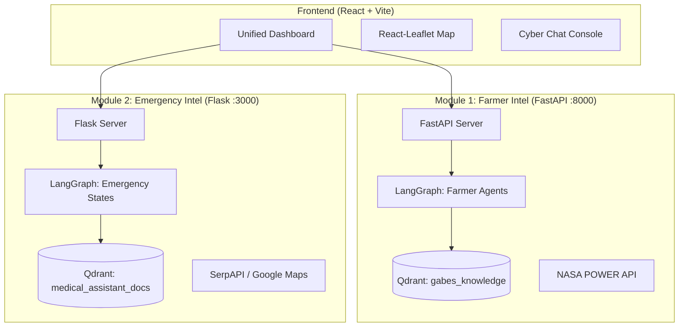

# Gabesi AIGuardian: Unified Environmental Intelligence


**Gabesi AIGuardian** is a unified environmental intelligence and emergency response platform designed specifically for the oasis farmers and residents of Gabès, Tunisia. By integrating real-time NASA satellite data, local industrial CO₂ monitoring, and a RAG-powered medical assistant, the system provides mission-critical advisory and life-saving triage in a region heavily impacted by industrial phosphate processing.

## 1. The Problem
The Gabès region faces a multi-decadal environmental crisis centered on the **Groupe Chimique Tunisien (GCT)**.
*   **Phosphogypsum Accumulation**: Over **150 million tonnes** of phosphogypsum have been discharged into the Gulf of Gabès.
*   **Emission Impact**: Current industrial activity generates an estimated economic burden of **76M TD/year** in health and environmental degradation.
*   **Agricultural Decline**: Soil acidification and air toxicity (SO₂, NO₂) have significantly reduced the yield of traditional Deglet Nour date palms and pomegranates.

## 2. System Overview
The platform operates as a unified React ecosystem served by a high-performance dual-backend architecture.



---

## 3. Module 1: Gabesi AIGuardian (Farmer Intelligence)
The primary intelligence module for agricultural resilience and pollution attribution.

*   **Agents**: 4-agent LangGraph system (`diagnosis`, `irrigation`, `pollution`, `pollution_qa`).
*   **LLM Engine**: `gpt-4o-mini` for all reasoning and tool orchestration.
*   **Vector Search**: `text-embedding-3-large` (1536 dims).
*   **RAG Infrastructure**:
    *   **Collections**:
        *   `gabes_knowledge`: 1718 chunks, 21 docs, 1536-dim (Core agricultural and environmental documents).
        *   `farmer_context`: 3072-dim zero-vector placeholder, runtime pollution event log.
        *   `satellite_timeseries`: Empty, reserved for future geospatial embeddings.
    *   **Chunker**: Chonkie SemanticChunker (Hybrid: Dense + Sparse BM25/IDF).
*   **Irrigation Engine**:
    *   **Math**: FAO-56 Penman-Monteith methodology.
    *   **Fallback**: Hargreaves-Samani estimation when `ALLSKY_SFC_SW_DWN` = -999.
    *   **Lookback**: 14-day NASA POWER historical weather data (T2M_MAX/T2M_MIN/ALLSKY_SFC_SW_DWN/WS2M/RH2M).
*   **Pollution Attribution**: 
    *   **Reference Coords**: GCT Complex at 33.9089°N, 10.1256°E.
    *   **Relative Thresholds**: Statistical P80/P95 bands based on Open-Meteo CAMS data.
    *   **Exposure Bands**: `near_gct` (~2km), `mid_exposure` (~5km), `lower_exposure` (~10km), `ultra_remote` (>10km).
*   **PDF Dossier Generation**:
    *   **Engine**: `reportlab` (3 pages: Risk Summary, Event Breakdown, Confidence & Limitations).
    *   **Features**: Risk badge (LOW/MODERATE/HIGH), legal disclaimer on every page.

---

## 4. Module 2: Emergency Intel (Triage & Monitoring)
A rapid-response module for medical emergencies and industrial CO₂ tracking.

*   **LangGraph Lifecycle**: `GREETING` → `LOCATION` → `SYMPTOMS` → `FOLLOW_UP` → `ESCALATION` → `LLM_FORMATTER`.
*   **Triage Logic**:
    *   **Escalation Condition**: `emergency_score >= 80`.
    *   **Score Formula**: `(symptom_weight × 0.60) + (pollution_risk × 0.25) + (duration_weight × 0.15)`.
    *   **Symptom Weights**: Deterministic mapping (Chest Pain: 95, Unconscious: 100).
    *   **Secondary Escalation**: `prolonged=True` when user responds "No/Worse" in `FOLLOW_UP`.
    *   **Inactivity Alarm**: A 60-second inactivity alarm triggers automatic escalation to emergency services (190).
*   **Analysis Agent Pipeline**:
    *   **Agent 1 (Analyst)**: Produces structured JSON (trend, seasonalPattern, complianceStatus).
    *   **Agent 2 (Strategist)**: Generates prioritized actions (`critique`, `important`, `souhaitable`).
*   **External APIs**:
    *   **SerpAPI**: Google Maps engine for geocoding text queries. *Note: SerpAPI is optional — system remains fully functional without it (location search degrades gracefully).*
    *   **OpenAI**: API provider for LLM and Embeddings.
*   **Monitoring Data**: Monthly CO₂ timeseries for 12 facilities.
    *   **Data Files**: `locations.json`, `usine_A_acide.json` through `usine_E_fluor.json`, `saet_power.json`, `ghannouch_gas.json`, `zone_urban_gabes.json`, `zone_agriculture_chenini.json`.

---

## 5. Unified Frontend & Design System
A premium "Mission Control" interface built for high-stakes environmental monitoring.

*   **Tech Stack**: React + Vite, Tailwind CSS, `react-leaflet`, `recharts`, `i18next`, `framer-motion`.
*   **Visual Excellence**:
    *   **Palette**: Deep Navy background (#0a0e1a), Neon Cyan accents, Purple highlights.
    *   **Glassmorphism**: `.glass-card` utility with backdrop-blur.
*   **Pages**: `/` (Chat), `/pollution`, `/irrigation`, `/emergency`.
*   **Languages**: English, French, Arabic with RTL support.
*   **Emergency Map**: Dynamic circles by risk level, timeline slider, session-based chat.
*   **Proxy Configuration**: Vite proxies `/risk-map` and `/search-location` to Flask on port 3000. Both backends (FastAPI port 8000, Flask port 3000) run simultaneously.

---

## 6. Security & Guardrails
A 4-layer chain protecting the LLM pipeline with ~800ms total latency. LangSmith produces **one unified trace per request**.

| Layer | Type | Latency | Purpose |
| :--- | :--- | :--- | :--- |
| **1. Medical** | Regex/Pattern | 0ms | Detects medical emergencies (chest pain, can't breathe) and returns the 190 emergency number in the user's language. |
| **2. Injection** | Pattern | 0ms | Detects prompt-injection attempts. |
| **3. Safety** | LLM Classifier | ~400ms | Filters toxicity and out-of-scope requests. |
| **4. Intent** | LLM Classifier | ~400ms | Routes query to correct LangGraph node. |

**Cost per Call:**
*   Blocked request: ~$0.0002
*   Full pipeline: ~$0.0007

---

## 7. Evaluation Results
Validated using **DeepEval** with 68 goldens and 56 mocked unit tests (0 real API calls).

### RAG & Diagnosis Performance
| Metric | Value | Success Rate | Notes |
| :--- | :--- | :--- | :--- |
| **Contextual Recall** | 0.9512 | 98.33% | 68 goldens |
| **Contextual Relevancy** | 0.4395 | 41.67% | Known artifact: multi-topic chunks avg 841 chars |
| **Faithfulness** | 0.9667 | 100% | 16 inputs |
| **Answer Relevancy** | 0.9115 | 100% | |
| **Pollution Link Accuracy**| 1.0000 | 100% | 16/16 |

### Irrigation Engine Accuracy
| Metric | Value | Success Rate |
| :--- | :--- | :--- |
| **Kc Lookup Accuracy** | 1.000 | 100% |
| **ETc Math Accuracy** | 1.000 | 100% |
| **GEval (Conversational)** | 0.883 | 100% |
| **No Jargon Violation** | 1.000 | 100% |

---

## 8. API Reference

| Method | Endpoint | Request Shape | Response Shape |
| :--- | :--- | :--- | :--- |
| **POST** | `/api/v1/chat` | `{"message": "str (min 3, max 2000)", "farmer_id": "str|null", "plot_id": "str|null", "language": "en|fr|ar", "crop_type": "date_palm|pomegranate|fig|olive|vegetables", "growth_stage": "initial|mid|end"}` | `{"response": "str", "state": "str"}` |
| **POST** | `/api/v1/diagnosis` | `{"symptom_description": "str (min 10, max 1000)", "language": "en|fr|ar", "farmer_id": "str|null", "plot_id": "str|null"}` | `{"diagnosis": "str", "confidence": float}` |
| **POST** | `/api/v1/irrigation` | `{"crop_type": "date_palm|pomegranate|fig|olive|vegetables", "growth_stage": "initial|mid|end", "language": "en|fr|ar", "farmer_id": "str|null", "plot_id": "str|null"}` | `{"irrigation_depth_mm": float, "et0_mm_day": float, "kc": float, "weather": {...}}` |
| **POST** | `/api/v1/pollution/report` | `{"farmer_id": "str", "plot_id": "str", "language": "en|fr|ar", "window_days": 30}` | `{"events": [...], "risk_level": "str"}` |
| **POST** | `/api/v1/pollution/dossier` | same as /pollution/report, returns application/pdf | PDF binary stream |
| **POST** | `/api/v1/pollution/qa` | `{"question": "str (min 10)", "language": "str"}` | `{"answer": "str", "sources": ["str"]}` |
| **GET** | `/api/v1/health` | None | `{"status": "ok", "collection": "gabes_knowledge", "timestamp": "ISO8601"}` |

---

## 9. Setup & Installation

### Backend Services
Both modules share one merged `requirements.txt` located at `backend/requirements.txt`.

**Terminal 1: FastAPI (Module 1)**
```cmd
cd backend
python -m venv .venv
.venv\Scripts\activate
pip install -r requirements.txt
uvicorn app.main:app --reload --port 8000
```

**Terminal 2: Flask (Module 2)**
```cmd
cd emergency_intel
.venv\Scripts\activate
python app.py
```

Uses the same venv as Module 1. Ensure backend/.venv is activated before running.

### Frontend (React + Vite)
**Terminal 3: React Dashboard**
```cmd
cd frontend
npm install
npm run dev
```

---

## 10. Project Structure
```text
.
├── backend/                   # FastAPI Server (Module 1)
│   ├── app/
│   │   ├── agents/            # LangGraph Implementation
│   │   ├── services/          # NASA/CAMS/Qdrant Connectors
│   │   └── guardrails/        # 4-Layer Chain
│   ├── tests/                 # DeepEval Test Suite
│   └── requirements.txt       # Unified dependencies
├── emergency_intel/           # Flask Server (Module 2)
│   ├── services/              # Triage & Analysis Agents
│   ├── data/                  # CO2 JSON Timeseries
│   └── app.py                 # Port 3000 Entry
├── frontend/                  # Unified React Frontend
│   ├── src/
│   │   ├── components/        # Glass-morphic UI components
│   │   ├── pages/             # Dashboard, Emergency, Irrigation
│   │   └── i18n/              # Lang files (EN/FR/AR)
│   └── vite.config.js         # Port Proxying Config
└── README.md
```

## 11. Roadmap
- [x] Integrate LangGraph state machines for complex multi-agent flows
- [x] Build and test 4-layer security guardrail chain
- [x] Connect robust RAG pipeline via Qdrant with hybrid semantic chunking
- [x] Develop precise FAO-56 math engine with NASA POWER historical weather data
- [x] Deploy modular UI with Vite and React
- [x] Merge legacy Emergency Intelligence Flask module
- [ ] Run end-to-end pipeline GEval at scale
